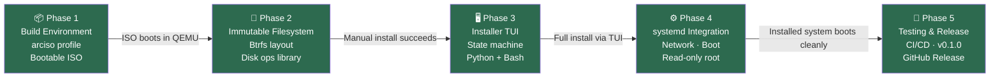
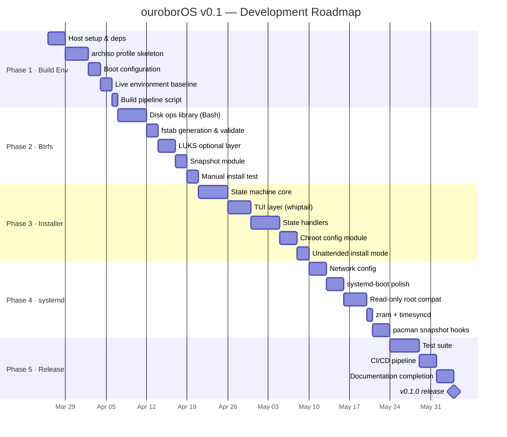

# ouroborOS — Implementation Plan

**Version:** 0.1 roadmap (complete) → Phase 2 complete
**Date:** 2026-04-08
**Branch:** dev

> **v0.1.0 released 2026-04-07.** All 5 phases complete. Phase 2 (post-v0.1.0) complete. See [docs/PHASE_2_PLAN.md](./docs/PHASE_2_PLAN.md) for details.

---

## Overview

This document defines the complete, phased implementation plan for ouroborOS v0.1 — a bootable, installable ArchLinux-based distribution with an immutable Btrfs root filesystem, systemd-native stack, and a TUI installer.

The plan is divided into **5 phases**. Each phase has defined milestones, deliverables, and acceptance criteria. Phases are sequential; each phase's completion gates the start of the next.

---

## Summary Table

| Phase | Name | Key Deliverable | Status |
|-------|------|----------------|--------|
| 1 | Build Environment | Bootable live ISO | ✅ Complete |
| 2 | Immutable Filesystem | Btrfs layout + installer disk ops | ✅ Complete |
| 3 | Installer TUI | Interactive installer | ✅ Complete |
| 4 | systemd Integration | Complete systemd config | ✅ Complete |
| 5 | Testing & Release | Tested, documented v0.1 | ✅ Complete — v0.1.0 released |

---

## Phase 1: Build Environment and archiso Profile

**Goal:** Produce a bootable live ISO that launches a shell/placeholder on tty1.

### Milestones

#### 1.1 Host environment setup
- [ ] `src/scripts/setup-dev-env.sh` installs all required tools without error
- [ ] QEMU with OVMF (UEFI firmware) available for testing
- [ ] `shellcheck` and `shfmt` available for code quality

#### 1.2 archiso profile skeleton
- [ ] Create `src/ouroborOS-profile/` directory with all required files
- [ ] `profiledef.sh` with correct metadata (`iso_name`, `iso_label`, `bootmodes`)
- [ ] `packages.x86_64` with minimal base: `base`, `linux-zen`, `linux-firmware`, `btrfs-progs`, `arch-install-scripts`, `dialog`, `python`, `python-yaml`
- [ ] `pacman.conf` using ArchLinux mirrors
- [ ] `airootfs/etc/mkinitcpio.conf` with `btrfs` in MODULES and HOOKS
- [ ] `airootfs/etc/os-release` with ouroborOS branding
- [ ] `airootfs/etc/motd` with welcome message

#### 1.3 Boot configuration
- [ ] `efiboot/loader/loader.conf` with 3s timeout
- [ ] `efiboot/loader/entries/01-ouroborOS.conf` pointing to linux-zen
- [ ] `efiboot/loader/entries/02-ouroborOS-accessibility.conf`
- [ ] SYSLINUX config for BIOS fallback

#### 1.4 Live environment baseline
- [ ] Auto-login as root on tty1
- [ ] Placeholder installer message on login (or shell)
- [ ] `systemd-networkd` + `iwd` enabled in live environment
- [ ] `systemd-resolved` enabled, `/etc/resolv.conf` symlinked

#### 1.5 Build pipeline
- [ ] `src/scripts/build-iso.sh` builds the ISO without errors
- [ ] SHA256 checksum generated alongside ISO
- [ ] ISO size < 800 MB

**Phase 1 Acceptance Criteria:**
- `sudo bash src/scripts/build-iso.sh` completes without error
- ISO boots in QEMU (UEFI mode) and shows a login prompt or installer placeholder
- `systemctl status systemd-networkd` shows active in live environment

---

## Phase 2: Immutable Filesystem — Btrfs Layout and Disk Operations

**Goal:** Implement all disk operations needed by the installer: partitioning, Btrfs subvolume creation, mounting with read-only root, and fstab generation.

### Milestones

#### 2.1 Disk operations library (Bash)
- [ ] Create `installer/ops/disk.sh`
- [ ] `partition_auto(disk)` — GPT, ESP + root using `sgdisk`
- [ ] `format_esp(device)` — `mkfs.fat -F32`
- [ ] `format_btrfs(device, label)` — `mkfs.btrfs`
- [ ] `create_subvolumes(device)` — creates `@`, `@var`, `@etc`, `@home`, `@snapshots`
- [ ] `mount_subvolumes(device, target)` — mounts all subvolumes with correct options
- [ ] `unmount_all(target)` — safe unmount in reverse order
- [ ] All functions: `set -euo pipefail`, `shellcheck`-clean, return meaningful exit codes

#### 2.2 fstab generation
- [ ] After mount, run `genfstab -U /mnt`
- [ ] Validate generated fstab contains `ro` on root entry
- [ ] Validation function rejects fstab without `ro` on `@`

#### 2.3 LUKS optional layer
- [ ] `encrypt_partition(device, passphrase)` — `cryptsetup luksFormat` + `open`
- [ ] Generates correct `crypttab` entry
- [ ] Kernel parameter `rd.luks.uuid=` added to boot entry when LUKS enabled

#### 2.4 Btrfs snapshot module
- [ ] Create `installer/ops/snapshot.sh`
- [ ] `create_snapshot(source, dest, readonly)` — wraps `btrfs subvolume snapshot`
- [ ] Creates `@snapshots/install` immediately after installation
- [ ] Generates systemd-boot entry for the install snapshot

#### 2.5 Manual install test
- [ ] All disk ops can be run manually in QEMU from live ISO shell
- [ ] After manual ops: `pacstrap /mnt base linux-zen btrfs-progs`
- [ ] System boots from installed Btrfs subvol (`subvol=@,ro`)

**Phase 2 Acceptance Criteria:**
- All Bash ops functions pass `shellcheck`
- Unit tests (mock-based) cover partition, format, mount, fstab validation
- Manual installation (disk ops + pacstrap + bootloader) succeeds in QEMU
- Installed system boots with root mounted read-only

---

## Phase 3: Installer TUI and State Machine

**Goal:** A fully interactive, stateful TUI installer that guides the user through installation and produces a working system.

### Milestones

#### 3.1 State machine core (Python)
- [ ] Create `installer/state_machine.py`
- [ ] `State` enum with all states
- [ ] `InstallerConfig` dataclass with all fields
- [ ] `Installer` class with `run()` loop
- [ ] Checkpoint system (write/read `.done` files)
- [ ] Config serialization to JSON after each state
- [ ] Resume from checkpoint on restart
- [ ] All state transitions tested with `pytest`

#### 3.2 TUI layer (Python + whiptail)
- [ ] Create `installer/tui.py`
- [ ] `show_welcome()` — project intro screen
- [ ] `show_locale_menu()` — language, keymap, timezone selection
- [ ] `show_disk_selection()` — list available disks with `lsblk`
- [ ] `show_partition_preview()` — display proposed layout before applying
- [ ] `show_progress(title, text, percent)` — gauge during pacstrap
- [ ] `show_user_creation()` — username, password (with confirmation)
- [ ] `show_summary()` — installation complete screen
- [ ] `show_error(message, recoverable)` — error screen with retry/abort

#### 3.3 State handlers
- [ ] `_handle_preflight()` — all system checks
- [ ] `_handle_locale()` — TUI locale selection → config update
- [ ] `_handle_partition()` — disk selection + layout preview + confirmation
- [ ] `_handle_format()` — calls `disk.sh` functions with progress feedback
- [ ] `_handle_install()` — `pacstrap` with live progress
- [ ] `_handle_configure()` — chroot operations (bootloader, users, network)
- [ ] `_handle_snapshot()` — baseline Btrfs snapshot
- [ ] `_handle_finish()` — summary + reboot prompt

#### 3.4 Chroot configuration module
- [ ] Create `installer/ops/configure.py` (or `configure.sh`)
- [ ] Set locale, timezone, hostname
- [ ] Run `mkinitcpio -P`
- [ ] Install systemd-boot: `bootctl install`
- [ ] Write `loader.conf` and default boot entry
- [ ] Enable systemd units: `systemd-networkd`, `systemd-resolved`, `iwd`
- [ ] Create user account (`useradd` or `homectl`)
- [ ] Configure sudoers
- [ ] Set root password (or lock root)

#### 3.5 Unattended install mode
- [ ] Config file auto-detection (cmdline, USB, `/tmp/`)
- [ ] Config YAML validation with clear error messages
- [ ] Skip all TUI screens when config present
- [ ] `ouroborOS-installer --validate-config /path/to/config.yaml`

#### 3.6 Installer entrypoint
- [ ] `ouroborOS-installer` (Bash) launches Python installer
- [ ] Handles `--help`, `--validate-config`, `--resume` flags
- [ ] Logs all output to `/tmp/ouroborOS-install.log`
- [ ] systemd service auto-starts installer on tty1

**Phase 3 Acceptance Criteria:**
- Full interactive installation from live ISO to working installed system
- All `pytest` unit tests pass (≥ 80% coverage)
- Unattended install works with the minimal config example from docs
- Installation log written to `/tmp/ouroborOS-install.log`
- Installer handles disk errors gracefully (retry/rollback)

---

## Phase 4: systemd Full Integration and Runtime Configuration

**Goal:** The installed system uses the full systemd stack correctly. Every component integrates cleanly.

### Milestones

#### 4.1 Network configuration
- [ ] `/etc/systemd/network/20-wired.network` installed correctly
- [ ] `/etc/systemd/network/25-wireless.network` for iwd
- [ ] `/etc/iwd/main.conf` with `EnableNetworkConfiguration=false`
- [ ] DNS resolves correctly (`resolvectl query archlinux.org`)
- [ ] DoT configured in `resolved.conf`

#### 4.2 systemd-boot polish
- [ ] Microcode auto-detection (intel-ucode vs amd-ucode)
- [ ] Correct `initrd` lines in boot entry
- [ ] Snapshot boot entry generated and functional
- [ ] Fallback entry works (boots with all modules)
- [ ] `bootctl status` shows healthy state

#### 4.3 Read-only root compatibility
- [ ] `/usr/local → /var/usrlocal` symlink via `tmpfiles.d`
- [ ] All standard paths writable that need to be
- [ ] `pacman -Syu` does not fail due to read-only root
  - Implement pacman hook to temporarily remount `@` as rw
  - Or: overlayfs upper layer approach (document decision)
- [ ] Installed packages persist across reboot

#### 4.4 zram setup
- [ ] `/etc/systemd/zram-generator.conf` with `zram-size = ram / 2`
- [ ] `systemd-zram-setup@zram0` enabled and active
- [ ] No swap partition created by installer

#### 4.5 Time synchronization
- [ ] `systemd-timesyncd` enabled and active
- [ ] Hardware clock synced (`hwclock --systohc`)
- [ ] Timezone set correctly

#### 4.6 pacman post-install hooks
- [ ] Hook: create Btrfs snapshot before `pacman -Syu`
- [ ] Hook: generate new systemd-boot entry for snapshot
- [ ] Hook: prune snapshots older than 30 days (keep last 5)
- [ ] Hook: run `bootctl update` after systemd package upgrade

**Phase 4 Acceptance Criteria:**
- Fresh-installed system boots cleanly with `systemd-boot`
- `systemctl --failed` shows no failed units
- Network works (wired DHCP + DNS)
- `pacman -Syu` runs successfully; new snapshot created; system re-boots
- Rolling back to previous snapshot works via boot menu

---

## Phase 5: Testing, CI/CD, and v0.1 Release

**Goal:** Automated testing pipeline, complete documentation, and a published v0.1 ISO.

### Milestones

#### 5.1 Test suite
- [ ] Python unit tests: all state machine states, config parsing, validation
- [ ] Bash unit tests: disk ops (using mock block devices or `bats`)
- [ ] Integration test: full QEMU install, automated with `expect` or Python pexpect
- [ ] Coverage: ≥ 80% for Python installer code

#### 5.2 CI/CD pipeline (GitHub Actions)
- [ ] `.github/workflows/build.yml` — build ISO on push to `dev`
  - Uses `archlinux:latest` container
  - Runs `mkarchiso`
  - Uploads ISO artifact
- [ ] `.github/workflows/test.yml` — run Python unit tests
- [ ] `.github/workflows/lint.yml` — `shellcheck` all `.sh` files, `flake8`/`ruff` for Python
- [ ] Artifacts: ISO + SHA256 stored as GitHub release assets

#### 5.3 Documentation completion
- [ ] `README.md` updated with installation instructions and download link
- [ ] `docs/architecture/overview.md` final review
- [ ] User guide: step-by-step installation guide
- [ ] Developer guide: how to build, how to contribute
- [ ] All skills reviewed and up to date

#### 5.4 Release
- [ ] Git tag: `v0.1.0`
- [ ] GitHub Release with:
  - ISO download
  - SHA256 checksum
  - GPG signature
  - Release notes (what's included, known limitations)
- [ ] `master` branch updated to `v0.1.0` via PR from `dev`

#### 5.5 Known limitations document (v0.1 scope)
- [ ] Document: BIOS not supported
- [ ] Document: No GUI installer
- [ ] Document: No AUR helper
- [ ] Document: Secure Boot not implemented
- [ ] Document: pacman write-to-root workaround details

**Phase 5 Acceptance Criteria:**
- All CI pipelines green on `dev` branch
- ISO boots and installs in clean QEMU environment without manual intervention
- All documented commands in README work as written
- GitHub Release published at tag `v0.1.0`

---

## Dependency Graph

## Roadmap Timeline

---

## Risk Register

| Risk | Probability | Impact | Mitigation |
|------|-------------|--------|-----------|
| pacman writes fail on read-only root | High | High | Implement pacman hook to remount rw before upgrade |
| archiso build fails on new Arch packages | Medium | Medium | Pin package versions in profile, test monthly |
| UEFI firmware differences between machines | Medium | Medium | Test on multiple QEMU firmware versions |
| Btrfs snapshot size grows unboundedly | Low | Medium | Implement rotation: keep last 5 + install baseline |
| Installer crashes mid-install (unclean state) | Medium | Medium | Checkpoint system + resume capability |
| Python not available in minimal live ISO | Low | High | Always include `python` in `packages.x86_64` |

---

## Out of Scope for v0.1

The following are explicitly deferred to future versions:

- BIOS/legacy boot support
- GUI installer (GTK/Qt)
- AUR helper integration (yay, paru)
- Secure Boot (TPM2, MOK)
- Custom kernel patches
- Desktop environment or window manager defaults
- Multi-language installer UI (English only for v0.1)
- Network installer (downloading packages during install)
- ZFS support
- ARM/aarch64 support

---

## Revision History

| Date | Version | Change |
|------|---------|--------|
| 2026-04-07 | 0.1-released | All phases complete, v0.1.0 published. Phase 2 (post-v0.1.0) in progress. |
| 2026-03-26 | 0.1-draft | Initial plan created in session 1 |
