# Phase 2 — Plan

> **Status:** complete
> **Follows:** v0.1.0 (Phase 1 complete)
> **Goal:** fix the two biggest friction points in v0.1.0 and introduce the `our-*` command namespace alongside desktop selection and container support.

---

## Context

v0.1.0 works end-to-end, but running the installer a few times in anger surfaced two real problems:

1. **User credentials are collected *after* the disk has been wiped.** In `src/installer/state_machine.py`, the TUI prompt for username and password lives inside `_handle_configure()` — meaning pacstrap has already run and the disk is already destroyed by the time the installer asks who you are. If you cancel the prompt, you lose your data for nothing. Any decision that requires human input has to happen **before** `_handle_format()`.
2. **There's no desktop selection.** The ISO ships a TTY-only base. Installing Hyprland, GNOME, or KDE is a manual post-install exercise. That's fine for minimalism, but it's friction for the people who want the immutable base *and* a usable desktop on first boot.

Phase 2 fixes both, and while we're in there, it also cleans up the command surface with a consistent `our-*` namespace and opens the door to systemd-native container workflows.

---

## The three big changes

### 1. Collect everything before touching the disk

The FSM is reordered so every human-interactive step runs before the disk is wiped. New state order:

```mermaid
flowchart LR
    INIT --> PRE[PREFLIGHT]
    PRE --> LOC[LOCALE]
    LOC --> USR["USER (new)"]
    USR --> DSK["DESKTOP (new)"]
    DSK --> PART[PARTITION]
    PART --> FMT[FORMAT]
    FMT --> INS[INSTALL]
    INS --> CFG[CONFIGURE]
    CFG --> SNP[SNAPSHOT]
    SNP --> FIN[FINISH]

    style USR fill:#2d3748,stroke:#38a169,color:#fff
    style DSK fill:#2d3748,stroke:#38a169,color:#fff
    style PART fill:#2d3748,stroke:#e53e3e,color:#fff
    style FMT fill:#2d3748,stroke:#e53e3e,color:#fff
```



The red states (`PARTITION`, `FORMAT`) are the point of no return. Everything green runs first, in memory, with zero destructive side effects. You can Ctrl+C the installer any time before the wipe confirmation and your disk stays untouched.

### 2. Desktop profiles

A new `desktop.profile` config field selects one of five starting points. These are **package sets**, not curated configurations — ouroborOS doesn't ship custom themes, custom keybindings, or custom settings. You pick a starting point, it gets installed, you configure it however you want.

| Profile | Packages | Display manager | Login |
|---------|----------|-----------------|-------|
| `minimal` | *(none — base only)* | — | TTY |
| `hyprland` | `hyprland xdg-desktop-portal-hyprland waybar foot wofi polkit-kde-agent qt5-wayland qt6-wayland` | — | TTY → `Hyprland` |
| `niri` | `niri xdg-desktop-portal-gnome foot fuzzel polkit-gnome qt5-wayland qt6-wayland` | — | TTY → `niri-session` |
| `gnome` | `gnome gnome-tweaks xdg-user-dirs` | `gdm` | Auto |
| `kde` | `plasma plasma-wayland-session kde-applications-meta` | `sddm` | Auto |

The profile is consumed in `_handle_install()` by concatenating `PROFILE_PACKAGES[profile]` to the existing pacstrap package list. Display manager enable happens in `configure.sh` based on a `DESKTOP_DM` environment variable. Profiles that don't ship a display manager (`minimal`, `hyprland`, `niri`) leave the user to log in from tty and launch their session manually — which is exactly what people in that camp want anyway.

#### Dependency notes

- **Hyprland + aquamarine:** `aquamarine` is the Wayland compositor backend for Hyprland ≥ 0.42. It is a hard dependency of the `hyprland` package on Arch and gets auto-pulled by pacman — no need to list it explicitly in the profile.
- **KDE package size:** `kde-applications-meta` installs **all** KDE applications (~300 packages, ~1.5 GB). Consider replacing it with a lighter set for the immutable-base philosophy: `plasma-desktop dolphin konsole kate gwenview ark ffmpegthumbs`. This would reduce the KDE profile from ~1.5 GB to ~400 MB while keeping the essentials. Decision deferred — the full meta is simpler for first-time users and `our-pac` makes rollback trivial if they want to prune later.
- **niri portal:** `xdg-desktop-portal-gnome` is used because niri doesn't have its own portal. This is the recommended upstream pairing.

### 3. The `our-*` command namespace

v0.1.0 shipped a single wrapper called `ouroboros-upgrade`. It's a mouthful, it's hard to type, and it doesn't leave room for siblings. Phase 2 establishes a consistent namespace:

| Command | Role | Status |
|---------|------|--------|
| `our-pac` | pacman wrapper with snapshot + remount | **Renamed** from `ouroboros-upgrade` |
| `our-container` | systemd-nspawn container wrapper | **New** |
| `our-snap` | snapshot management (list, prune, rollback) | *Phase 3* |
| `our-rollback` | quick rollback without reboot | *Phase 3* |

A compatibility symlink `ouroboros-upgrade → our-pac` ships for one release cycle, then gets removed in Phase 3. All documentation is updated in lockstep.

---

## Additional scope

### systemd-homed default-on

v0.1.0 creates users the classic way (`useradd` + `/etc/passwd`). Phase 2 makes `systemd-homed` the default, which gets us:

1. **Portability** — a home is a self-contained image or subvolume that moves between machines.
2. **Consistency** with the rest of the systemd-native stack.
3. **Optional per-user encryption** — available with `luks` storage (see below).

#### Storage backends

| Backend | Encryption | Snapshots | Overhead | Use case |
|---------|-----------|-----------|----------|----------|
| `subvolume` | ❌ No | ✅ Btrfs-native | Minimal | Default — fast, snapshot-friendly |
| `luks` | ✅ LUKS2 per-user | ❌ No | Moderate | Encrypted homes without full-disk LUKS |
| `directory` | ❌ No | ❌ No | Minimal | Fallback if subvolume fails |
| `classic` | ❌ No | ❌ No | None | Opt-out — legacy `/etc/passwd` |

**⚠️ `subvolume` does NOT encrypt home directories.** If per-user encryption is needed, use `luks` storage. The default `subvolume` was chosen for zero overhead on top of the already-encrypted root (when LUKS full-disk is enabled during install).

#### Migration path (install → first boot)

> **Note:** `homectl register` does **not exist**. The conversion requires explicit steps.

During install, the user is created with `useradd` (classic). On first boot, a oneshot systemd unit (`ouroboros-homed-migration.service`) performs the migration **before getty starts** (so the user hasn't logged in yet):

```
1. systemctl stop user@1000.service  # if running
2. mv /home/$USERNAME /home/$USERNAME.old
3. homectl create $USERNAME \
     --storage=$HOMED_STORAGE \
     --disk-size=max \
     --uid=1000 \
     --member-of=wheel,audio,video,input \
     --shell=/bin/bash
4. homectl activate $USERNAME  # mounts the new home
5. rsync -aHAX /home/$USERNAME.old/ /home/$USERNAME/
6. # Remove the classic passwd/shadow entry — homed now owns the user
7. sed -i "/^${USERNAME}:/d" /etc/passwd /etc/shadow /etc/group /etc/gshadow
8. rm -rf /home/$USERNAME.old
```

The migration unit is only installed when `user.homed_storage != "classic"`. A new `user.homed_storage` field is added to the YAML schema and defaults to `subvolume` if omitted.

#### Known risks

1. **`@home` subvolume conflict:** homed creates homes as `/home/$USERNAME.homedir` for `subvolume`/`directory` storage. The existing `@home` Btrfs subvolume is mounted at `/home`. A homed-managed subvolume inside another subvolume (`@home/$USERNAME.homedir`) is untested and may conflict. **Mitigation:** E2E test this early; if it fails, either mount `@home` differently or switch default to `directory`.

2. **SSH + homed incompatibility:** `sshd` authenticates via PAM. With homed active, PAM must include `pam_systemd_home.so` — otherwise SSH logins fail because sshd looks up the user in `/etc/passwd` (which no longer has the entry after migration). Arch's default `sshd_config` and PAM stack do NOT include `pam_systemd_home.so`. **Mitigation:** the migration unit must also patch `/etc/pam.d/system-auth` to add `pam_systemd_home.so` before the migration removes the passwd entry.

3. **UID range:** `homectl create` defaults to UIDs 60001–60513, not 1000+. The `--uid=1000` flag forces the traditional UID, but this may have edge cases with systemd's UID policy. **Mitigation:** verify in E2E that the UID is respected and `sudo`/`wheel` group membership works.

### systemd-nspawn via `our-container`

ouroborOS is intentionally minimal, but users are going to want software that doesn't fit cleanly on a read-only root — browsers with plugins, heavy IDEs, proprietary apps, games. The systemd-native answer is `systemd-nspawn`: lightweight containers managed by `machinectl`, sharing the kernel, zero Docker overhead, full journal + networkd integration.

`our-container` is a thin bash wrapper that gives the user a Docker-like verb surface on top of `machinectl`:

```
our-container create <name> [distro]   # bootstrap a container (default: arch)
our-container enter <name>              # machinectl shell
our-container start <name>              # boot the container
our-container stop <name>               # stop the container
our-container list                      # machinectl list
our-container remove <name>             # machinectl remove
```

#### Bootstrap method

Containers are bootstrapped using the standard Arch toolchain — no custom images:

| Distribution | Tool | Notes |
|-------------|------|-------|
| `arch` (default) | `pacstrap -c` | Minimal `base` metapackage; container gets its own pacman |
| `debian` | `debootstrap` | Requires `debootstrap` package on host |
| `ubuntu` | `debootstrap` | Requires `debootstrap` package on host |

`pacstrap -c` (not `-C`) uses the host's package cache, avoiding redundant downloads. Each container is its own Btrfs subvolume under `/var/lib/machines/`, enabling independent snapshots.

Other options considered and rejected:
- **mkosi**: too heavyweight for thin containers, better suited for image builds
- **import-tar**: requires pre-built tarballs, not self-contained
- **machinectl pull-tar**: network-dependent, limited to distros with tarball URLs

#### Networking model

Containers use **shared networking** (host network stack) by default — no bridge, no NAT, no veth pair. This matches the ouroborOS philosophy of minimal overhead:

- Container processes share the host's network namespace
- `systemd-networkd` on the host manages connectivity
- No additional firewall rules or bridge configuration needed
- Port conflicts are possible (same namespace) — documented as a tradeoff

Bridged networking (private container network via `--network-veth`) is deferred to Phase 3 for users who need network isolation.

#### Storage

Containers live in `/var/lib/machines/`, which is inside the writable `@var` subvolume. Each container is its own Btrfs subvolume, so it can be snapshotted independently of the host.

Phase 2 stops there — no Wayland/PipeWire passthrough, no GUI-app launchers. Those are Phase 3 if the community asks for them.

---

## Deliverables checklist

- [x] `docs/PHASE_2_PLAN.md` (this file)
- [x] `src/installer/desktop_profiles.py` — `PROFILE_PACKAGES`, `PROFILE_DM`
- [x] `src/installer/config.py` — `DesktopConfig` dataclass, `UserConfig.homed_storage`, validation, YAML loader
- [x] `src/installer/tui.py` — `show_desktop_selection()` (Rich + whiptail)
- [x] `src/installer/state_machine.py` — new `USER` and `DESKTOP` states, reordered `_STATE_ORDER`, profile injection in `_handle_install()`, `DESKTOP_DM` exported to configure env
- [x] `src/installer/ops/configure.sh` — conditional display manager enable, homed enable, homed registration unit
- [x] `src/ouroborOS-profile/airootfs/usr/local/bin/our-pac` — renamed from `ouroboros-upgrade`, with compatibility symlink
- [x] `src/ouroborOS-profile/airootfs/usr/local/bin/our-container` — new nspawn wrapper (17 commands, 1786 lines)
- [x] `templates/install-config.yaml` — documented `desktop:` and `user.homed_storage:` sections
- [x] `docs/user-guide.md`, `README.md`, `CLAUDE.md` — replace `ouroboros-upgrade` with `our-pac`, document `our-container`
- [x] `src/installer/tests/` — update FSM order tests, config tests, TUI tests (280 passed, 0 failed)
- [x] `IMPLEMENTATION_PLAN.md` — mark Phase 2 complete

---

## Verification

```bash
# Lint
shellcheck src/installer/ops/*.sh src/ouroborOS-profile/airootfs/usr/local/bin/our-*
ruff check --line-length 120 src/installer/

# Unit tests
pytest src/installer/tests/ -v

# FSM order — prompts must appear in this order in TUI mode:
#   locale → hostname → user → desktop → disk → luks → confirm → (wipe)
# show_user_creation() must NOT be reachable from _handle_configure() anymore.

# E2E (QEMU, unattended YAML) — one run per profile:
#   minimal, hyprland, gnome (verify gdm active), kde (verify sddm active)

# Point-of-no-return sanity check:
#   Boot installer, walk to the desktop-selection prompt, Ctrl+C.
#   The target disk must still have its original partition table.
```

---

## Out of scope (Phase 3+)

- Secure Boot (TPM2/MOK)
- Multi-language installer UI
- Snapshot pruning automation (`our-snap`)
- nspawn passthrough for Wayland / PipeWire / GPU
- ARM / aarch64
- GUI installer
