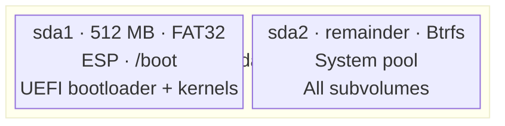
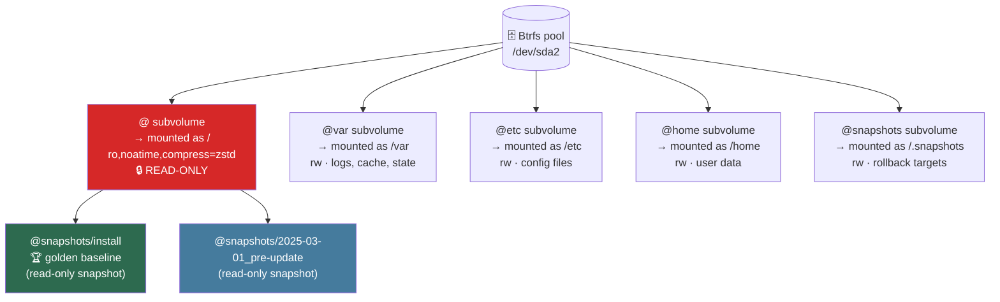
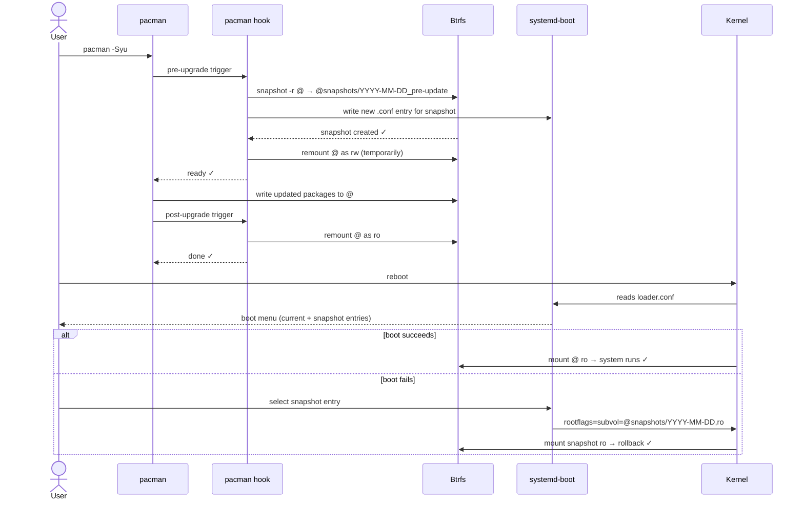

# Immutability Strategy

## Goal

Provide a system where the root filesystem (`/`) is **read-only at runtime**, preventing accidental or malicious modification of core system files, while still allowing:
- Normal package updates via atomic snapshots
- Per-user writable home directories
- System-wide mutable state in `/var` and `/etc`
- Full rollback to any previous system state

---

## Chosen Approach: Btrfs Subvolumes + Read-Only Root

### Why not OSTree?
| Criterion | OSTree | Btrfs Snapshots |
|-----------|--------|-----------------|
| pacman compatibility | Poor (RPM-centric) | Native |
| Complexity | High | Low-Medium |
| ArchLinux tooling | External | Built-in |
| Atomic updates | Yes | Yes |
| Rollback | Yes | Yes |
| Dependency | libostree | btrfs-progs |

Btrfs was chosen for its native integration with the ArchLinux/pacman ecosystem.

---

## Partition Layout



For single-disk installs, `/home` can share the root Btrfs pool via subvolumes.

---

## Btrfs Subvolume Layout



### fstab entries (generated by installer)

```
# <device>   <mount>        <type>  <options>                        <dump> <pass>
UUID=XXX      /              btrfs   subvol=@,ro,noatime,compress=zstd  0      1
UUID=XXX      /.snapshots    btrfs   subvol=@snapshots,noatime          0      2
UUID=XXX      /var           btrfs   subvol=@var,noatime,compress=zstd  0      2
UUID=XXX      /etc           btrfs   subvol=@etc,noatime                0      2
UUID=XXX      /home          btrfs   subvol=@home,noatime,compress=zstd 0      2
tmpfs         /tmp           tmpfs   defaults,nosuid,nodev              0      0
UUID=YYY      /boot          vfat    umask=0077                         0      2
```

Key mount option: **`ro`** on the `@` subvolume makes root read-only.

---

## Handling Read-Only Root

Certain paths need to remain writable at runtime:

| Path | Solution |
|------|----------|
| `/etc` | Separate `@etc` Btrfs subvolume (read-write) |
| `/var` | Separate `@var` Btrfs subvolume (read-write) |
| `/tmp` | tmpfs |
| `/home` | Separate `@home` subvolume or systemd-homed |
| `/usr/local` | Bind-mount from `/var/usrlocal` |

### Symlinks for compatibility
```
/usr/local → /var/usrlocal   (or overlayfs upper)
```

---

## Atomic Update Flow



### systemd-boot snapshot entries
Each snapshot gets a boot entry in `/boot/loader/entries/`:
```ini
# /boot/loader/entries/ouroborOS-snapshot-2025-01-15.conf
title   ouroborOS (snapshot 2025-01-15)
linux   /vmlinuz-linux-zen
initrd  /initramfs-linux-zen.img
options root=UUID=XXX rootflags=subvol=@snapshots/2025-01-15,ro quiet
```

---

## Rollback Procedure

```bash
# List available snapshots
btrfs subvolume list / | grep snapshots

# Boot into snapshot (at boot menu, or via command)
bootctl set-default ouroborOS-snapshot-YYYY-MM-DD.conf

# Promote snapshot to current root (permanent rollback)
btrfs subvolume snapshot /.snapshots/YYYY-MM-DD @_new
btrfs subvolume set-default <id> /
# Reboot
```

---

## Installer Responsibilities

The installer must:
1. Format disk with GPT
2. Create ESP and Btrfs partitions
3. Create all subvolumes (`@`, `@var`, `@etc`, `@home`, `@snapshots`)
4. Mount with correct options
5. Run `pacstrap` into the mounted tree
6. Generate correct `fstab` with `ro` flag on `@`
7. Configure mkinitcpio with `btrfs` hook
8. Create initial snapshot: `@snapshots/install`

---

## References
- [Btrfs Wiki — Snapper](https://wiki.archlinux.org/title/Snapper)
- [ArchLinux Btrfs](https://wiki.archlinux.org/title/Btrfs)
- [systemd-repart](https://www.freedesktop.org/software/systemd/man/systemd-repart.html)
