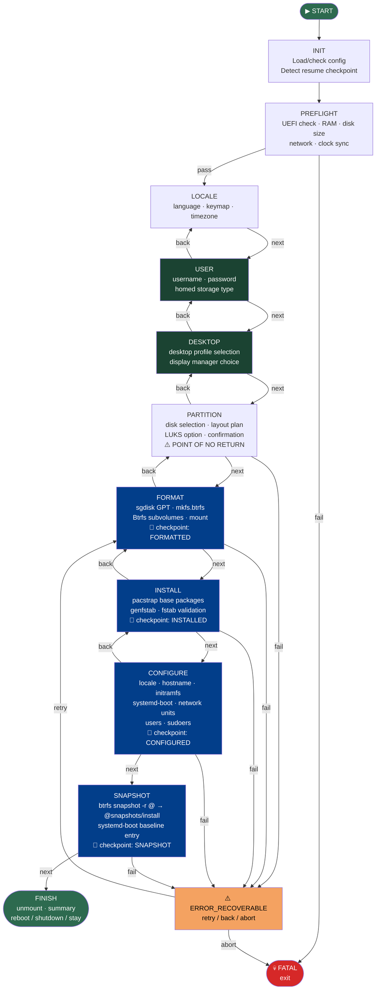

# Installer Phases

## Overview

The ouroborOS installer is a multi-phase, stateful process modelled as a finite state machine (FSM). Each phase has a defined entry condition, set of operations, exit condition, and rollback strategy.

The FSM is implemented in Python (`state_machine.py`) and orchestrates Bash operations (`ops/*.sh`) for system-level changes.

---

## State Machine Diagram



---

## State Enum

```python
class State(Enum):
    INIT = auto()              # Load config, detect resume; optional remote URL prompt
    PREFLIGHT = auto()         # Validate environment
    LOCALE = auto()            # Set regional settings
    USER = auto()              # Username, password, homed storage type (pre-wipe)
    DESKTOP = auto()           # Desktop profile + display manager (pre-wipe)
    PARTITION = auto()         # Define disk layout — POINT OF NO RETURN
    FORMAT = auto()            # Write partitions + filesystems
    INSTALL = auto()           # pacstrap base + desktop profile packages
    CONFIGURE = auto()         # Bootloader, network, users, homed, DM
    SNAPSHOT = auto()          # Baseline snapshot
    FINISH = auto()            # Cleanup + post-install action
    ERROR_RECOVERABLE = auto() # Retry possible
    FATAL = auto()             # Abort
```

---

## Checkpoint System

Checkpoints are saved to `/tmp/ouroborOS-checkpoints/` (on the live ISO) after each destructive state:

> **Note:** USER and DESKTOP states have no checkpoint — they are pre-wipe interactive states with no destructive effect. If the installer is interrupted before PARTITION, simply restart from the beginning.

| Checkpoint File | State |
|----------------|-------|
| `formatted.done` | FORMAT |
| `installed.done` | INSTALL |
| `configured.done` | CONFIGURE |
| `snapshot.done` | SNAPSHOT |

The full `InstallerConfig` is serialized to `config.json` alongside each checkpoint, enabling `--resume` to pick up where the installer left off.

---

## Phase Details

### INIT
**Purpose:** Load configuration and detect if a previous installation can be resumed.

**Actions:**
- Parse CLI arguments (`--config`, `--resume`, `--validate-config`)
- Search for unattended config via `find_unattended_config()` (kernel cmdline → `/tmp` → `/run` → USB drives)
- If `--resume`: load last checkpoint from `/tmp/ouroborOS-checkpoints/` and skip to that state
- If no config found: launch interactive TUI

---

### PREFLIGHT
**Purpose:** Validate that installation can proceed safely.

**Checks:**
- [ ] UEFI boot mode detected (`/sys/firmware/efi` exists)
- [ ] At least 2 GB RAM available
- [ ] At least one disk ≥ 20 GB detected
- [ ] Internet connectivity (ping archlinux.org or cached packages)
- [ ] System clock synchronized (timedatectl status)

**On failure:** Display diagnostic message, exit with `FATAL`. No changes made to disk.

---

### LOCALE
**Purpose:** Set regional settings for the installed system.

**User inputs:**
- Language / locale (e.g., `en_US.UTF-8`)
- Keyboard layout (e.g., `us`, `es`, `de`)
- Timezone (e.g., `America/New_York`)

**Rollback:** N/A (no disk changes).

---

### USER
**Purpose:** Collect user account information before any destructive operation.

**User inputs:**
- Username (POSIX-compliant)
- Password (plaintext — auto-hashed to SHA-512 before storage)
- Home storage type: `classic` (default) | `subvolume` | `directory` | `luks`

**Rollback:** N/A (no disk changes).

---

### DESKTOP
**Purpose:** Select desktop environment and display manager before any destructive operation.

**User inputs:**
- Desktop profile: `minimal` | `hyprland` | `niri` | `gnome` | `kde`
- Display manager: auto-detected from profile, or explicitly overridden

**Actions:**
- Store profile selection in config for INSTALL phase (package sets) and CONFIGURE phase (DM enable)

**Rollback:** N/A (no disk changes).

---

### PARTITION
**Purpose:** Define disk layout without writing to disk yet.

**User inputs:**
- Target disk selection
- LUKS encryption? (optional)

**Actions:**
- Display disk overview (`lsblk`, `fdisk -l`)
- Show proposed partition table (dry-run)
- **Confirmation required before proceeding**

**Rollback:** N/A (no changes until FORMAT phase).

---

### FORMAT
**Purpose:** Write partition table and create filesystems.

**Actions:**
1. Write GPT with `sgdisk`
2. Format ESP: `mkfs.fat -F32`
3. Format root: `mkfs.btrfs -L ouroborOS`
4. Create Btrfs subvolumes: `@`, `@var`, `@etc`, `@home`, `@snapshots`
5. Mount subvolumes with correct options (see [immutability-strategy.md](./immutability-strategy.md))
6. Generate fstab

**Rollback:** Wipe partition table with `sgdisk --zap-all`.

**Checkpoint saved:** `FORMATTED`

---

### INSTALL
**Purpose:** Install base system packages into the mounted target.

**Actions:**
1. Install base packages via `pacstrap /mnt` (packages from `packages.x86_64`)
2. Generate fstab: `genfstab -U /mnt >> /mnt/etc/fstab`
3. Validate fstab for `ro` flag on root subvolume

**Rollback:** Unmount and reformat (return to FORMAT phase).

**Checkpoint saved:** `INSTALLED`

---

### CONFIGURE
**Purpose:** Configure the installed system (bootloader, network, users).

**Actions (via `arch-chroot`):**

1. **Locale & timezone:** `locale-gen`, `/etc/locale.conf`, `/etc/vconsole.conf`
2. **Hostname:** `/etc/hostname`
3. **Initramfs:** `mkinitcpio -P` with btrfs hook
4. **Bootloader:** `bootctl install` + EFI boot entry via `efibootmgr` (from host, since chroot cannot write real NVRAM)
5. **Microcode:** Auto-detect CPU vendor → install `intel-ucode` or `amd-ucode`, add initrd to boot entry
6. **Network:** Enable `systemd-networkd`, `systemd-resolved`, `iwd`
7. **Immutable root:** `_write_systemd_enables_to_root()` — mirror essential systemd files to `@` subvolume
8. **User creation:** `useradd` with hashed password, wheel group
9. **Journal:** Mask `/var/log/journal` on `@` to prevent FAILED socket at boot

**Rollback:** Return to INSTALL phase.

**Checkpoint saved:** `CONFIGURED`

---

### SNAPSHOT
**Purpose:** Create the baseline immutable snapshot of the clean install.

**Actions:**
```bash
btrfs subvolume snapshot -r /mnt/@ /mnt/.snapshots/install
```

This snapshot is the **golden baseline** — always available for rollback.

Boot entry for baseline written to `/boot/loader/entries/`.

---

### FINISH
**Purpose:** Clean up and present completion to user.

**Actions:**
1. Unmount all filesystems in reverse order
2. Display installation summary
3. Execute `post_install_action`: **reboot** (default), **shutdown**, or **stay** in live environment

---

## Error Handling

| Error Type | Recovery Strategy |
|------------|------------------|
| Preflight failure | Exit with `FATAL`, show diagnostic |
| Disk write error | Wipe disk, return to PARTITION |
| pacstrap failure | Retry up to 3x (network), then `ERROR_RECOVERABLE` |
| chroot command failure | Log to `/tmp/ouroborOS-install.log`, prompt retry |
| Bootloader install failure | Retry `bootctl install`, check ESP mount |

All errors are logged to `/tmp/ouroborOS-install.log` on the live system.

---

## Configuration File (unattended install)

See [configuration-format.md](../installer/configuration-format.md) for the YAML schema used for unattended/scripted installations.
