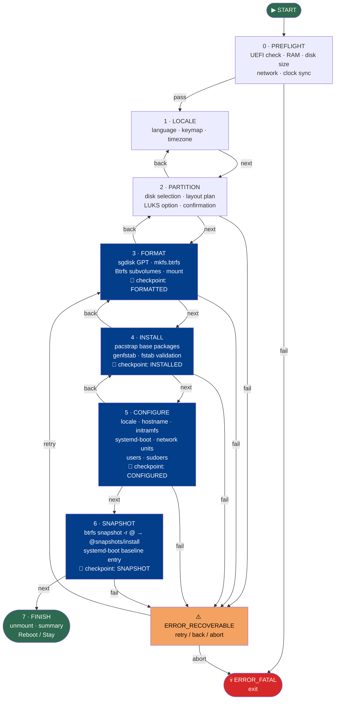

# Installer Phases

## Overview

The ouroborOS installer is a multi-phase, stateful process. Each phase has a defined entry condition, set of operations, exit condition, and rollback strategy.

---

## State Machine Diagram



---

## Phase Details

### Phase 0: PREFLIGHT
**Purpose:** Validate that installation can proceed safely.

**Checks:**
- [ ] UEFI boot mode detected (`/sys/firmware/efi` exists)
- [ ] At least 2 GB RAM available
- [ ] At least one disk ≥ 20 GB detected
- [ ] Internet connectivity (ping archlinux.org or cached packages)
- [ ] System clock synchronized (timedatectl status)

**On failure:** Display diagnostic message, exit with `ERROR_FATAL`. No changes made to disk.

---

### Phase 1: LOCALE
**Purpose:** Set regional settings for the installed system.

**User inputs:**
- Language / locale (e.g., `en_US.UTF-8`)
- Keyboard layout (e.g., `us`, `es`, `de`)
- Timezone (e.g., `America/New_York`)

**Actions:**
- Store selection in `/tmp/ouroborOS-config.yaml`
- Set live environment locale immediately (`localectl set-locale`)

**Rollback:** N/A (no disk changes).

---

### Phase 2: PARTITION
**Purpose:** Define disk layout without writing to disk yet.

**User inputs:**
- Target disk selection
- Partition scheme:
  - Auto (recommended): ESP 512M + Btrfs remainder
  - Manual: Custom sizes and additional partitions
- Encryption: LUKS on root? (optional)

**Actions:**
- Display disk overview (`lsblk`, `fdisk -l`)
- Show proposed partition table (dry-run)
- **Confirmation required before proceeding**

**Rollback:** N/A (no changes until FORMAT phase).

---

### Phase 3: FORMAT
**Purpose:** Write partition table and create filesystems.

**Actions:**
1. Write GPT with `sgdisk` or `systemd-repart`
2. Format ESP: `mkfs.fat -F32 /dev/sda1`
3. Format root: `mkfs.btrfs -L ouroborOS /dev/sda2`
4. Create Btrfs subvolumes:
   ```bash
   mount /dev/sda2 /mnt
   btrfs subvolume create /mnt/@
   btrfs subvolume create /mnt/@var
   btrfs subvolume create /mnt/@etc
   btrfs subvolume create /mnt/@home
   btrfs subvolume create /mnt/@snapshots
   umount /mnt
   ```
5. Mount subvolumes with correct options (see [immutability-strategy.md](./immutability-strategy.md))

**Rollback:** Wipe partition table with `sgdisk --zap-all`. Present re-entry to PARTITION phase.

**Checkpoint saved:** `FORMATTED`

---

### Phase 4: INSTALL
**Purpose:** Install base system packages into the mounted target.

**Actions:**
1. Install base packages:
   ```bash
   pacstrap /mnt \
     base linux-zen linux-zen-headers linux-firmware \
     btrfs-progs systemd-boot efibootmgr \
     iwd networkmanager-iwd \
     neovim git sudo man-db
   ```
2. Generate fstab:
   ```bash
   genfstab -U /mnt >> /mnt/etc/fstab
   ```
3. Validate fstab for `ro` flag on root subvolume

**Progress display:** Package download + install progress bar.

**Rollback:** Unmount and reformat (return to FORMAT phase).

**Checkpoint saved:** `INSTALLED`

---

### Phase 5: CONFIGURE
**Purpose:** Configure the installed system (bootloader, network, users).

**Actions (inside systemd-nspawn chroot):**

1. **Locale & timezone:**
   ```bash
   ln -sf /usr/share/zoneinfo/ZONE /etc/localtime
   hwclock --systohc
   echo "en_US.UTF-8 UTF-8" >> /etc/locale.gen
   locale-gen
   echo "LANG=en_US.UTF-8" > /etc/locale.conf
   echo "KEYMAP=us" > /etc/vconsole.conf
   ```

2. **Hostname:**
   ```bash
   echo "ouroborOS" > /etc/hostname
   ```

3. **Initramfs** (with btrfs hook):
   ```bash
   # /etc/mkinitcpio.conf HOOKS: base udev autodetect modconf kms keyboard keymap consolefont block btrfs filesystems fsck
   mkinitcpio -P
   ```

4. **Bootloader:**
   ```bash
   bootctl install
   # Write /boot/loader/loader.conf
   # Write /boot/loader/entries/ouroborOS.conf
   ```

5. **Network units:**
   ```bash
   systemctl enable systemd-networkd systemd-resolved iwd
   ```

6. **User creation:**
   ```bash
   useradd -m -G wheel -s /bin/bash USER
   echo "USER:PASS" | chpasswd
   # or: homectl create USER --storage=luks
   ```

7. **sudoers:**
   ```bash
   echo "%wheel ALL=(ALL:ALL) ALL" > /etc/sudoers.d/wheel
   ```

**Rollback:** Return to INSTALL phase.

**Checkpoint saved:** `CONFIGURED`

---

### Phase 6: SNAPSHOT
**Purpose:** Create the baseline immutable snapshot of the clean install.

**Actions:**
```bash
btrfs subvolume snapshot -r /mnt/@ /mnt/.snapshots/install
```

This snapshot is the **golden baseline** — always available for rollback.

Boot entry for baseline:
```ini
# /boot/loader/entries/ouroborOS-baseline.conf
title   ouroborOS (baseline install)
linux   /vmlinuz-linux-zen
initrd  /initramfs-linux-zen.img
options root=UUID=XXX rootflags=subvol=@snapshots/install,ro quiet
```

---

### Phase 7: FINISH
**Purpose:** Clean up and present completion to user.

**Actions:**
1. Unmount all filesystems in reverse order
2. Display installation summary
3. Prompt: **Reboot now** or **Stay in live environment**

---

## Error Handling

| Error Type | Recovery Strategy |
|------------|------------------|
| Preflight failure | Exit, show diagnostic |
| Disk write error | Wipe disk, return to PARTITION |
| pacstrap failure | Retry up to 3x (network), then manual intervention |
| chroot command failure | Log to `/tmp/ouroborOS-install.log`, prompt retry |
| Bootloader install failure | Retry `bootctl install`, check ESP mount |

All errors are logged to `/tmp/ouroborOS-install.log` on the live system.

---

## Configuration File (unattended install)

See [configuration-format.md](../installer/configuration-format.md) for the YAML schema used for unattended/scripted installations.
