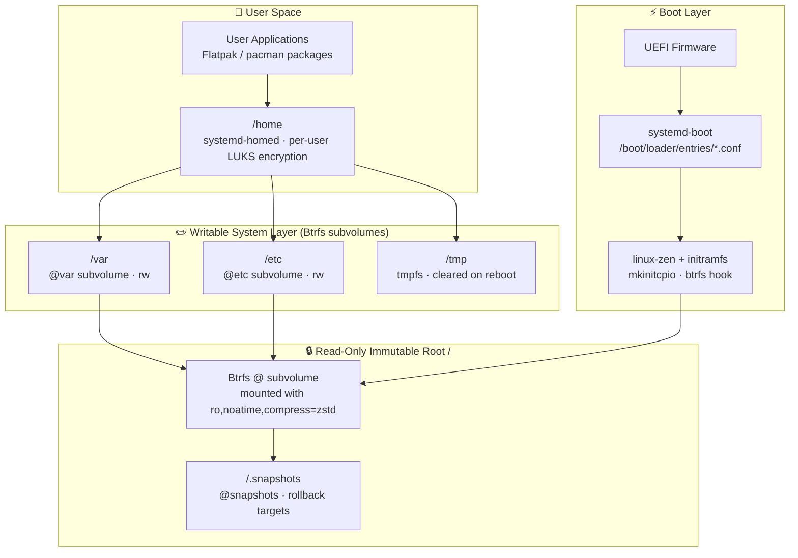
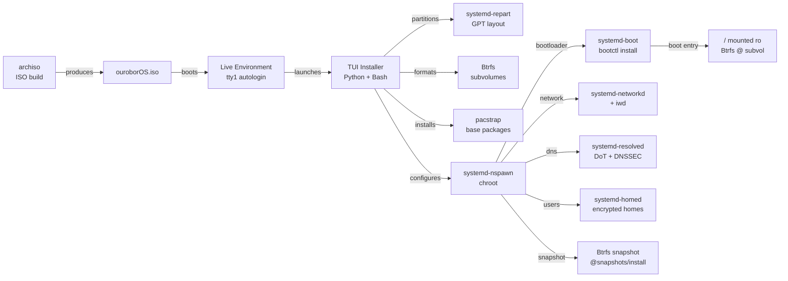

# ouroborOS — Architecture Overview

## Philosophy

ouroborOS takes its name from the ouroboros, the ancient symbol of a serpent consuming its own tail — representing **continuous self-renewal, self-containment, and cyclical evolution**. These principles guide every architectural decision:

- **Immutability**: The root filesystem is read-only. Changes are deliberate, atomic, and reversible.
- **Self-renewal**: Updates are atomic snapshots, not in-place mutations. Rollback is always one command away.
- **Minimal bloat**: Only what is needed is included. Every component must justify its presence.
- **systemd-native**: The entire user-space lifecycle — boot, networking, storage, identity — is managed through the systemd ecosystem.
- **ArchLinux base**: Rolling release model, bleeding-edge packages, pacman for package management.

---

## System Layer Diagram



---

## Component Relationships



---

## Core Components

| Component | Role |
|-----------|------|
| **archiso** | Live ISO build framework |
| **systemd-boot** | UEFI bootloader (replaces GRUB) |
| **Btrfs** | Filesystem with snapshots and subvolumes |
| **overlayfs** | Writable layer over read-only root |
| **systemd-repart** | Declarative partition layout at install time |
| **systemd-networkd** | Network configuration (wired + wireless) |
| **systemd-resolved** | DNS resolution with DoT support |
| **systemd-homed** | Portable, encrypted home directories |
| **systemd-firstboot** | First-boot configuration wizard |
| **systemd-nspawn** | Isolated chroot during installation |
| **mkinitcpio** | Initramfs generation with custom hooks |

---

## Key Design Decisions

### 1. Immutability via Btrfs (not OSTree)
OSTree was evaluated but rejected due to poor pacman integration. Btrfs subvolumes + read-only root mount provides equivalent immutability with native ArchLinux tooling. See [immutability-strategy.md](./immutability-strategy.md).

### 2. systemd-boot over GRUB
GRUB adds complexity (grub.cfg, update-grub, theme management). systemd-boot is minimal, UEFI-native, and integrates with `bootctl` and kernel install hooks. Only UEFI systems are supported.

### 3. Installer written in Bash + Python
- **Bash**: Low-level operations (partitioning, mounting, pacstrap, chroot)
- **Python**: TUI logic (state machine, user input validation, config serialization)
- **whiptail/dialog**: Terminal UI rendering

### 4. No NetworkManager
`systemd-networkd` + `iwd` (for WiFi) covers all networking needs without the overhead of NetworkManager.

---

## Repository Structure

```
ouroborOS/
├── CLAUDE.md                  # Claude Code project instructions
├── IMPLEMENTATION_PLAN.md     # Phased implementation roadmap
├── README.md                  # Public project README
├── docs/                      # Technical documentation
│   ├── architecture/          # System design decisions
│   ├── build/                 # ISO build process
│   ├── installer/             # Installer architecture
│   ├── messages/              # Project log and decisions
│   └── scripts/               # Build and setup scripts
└── skills/                    # Claude Code expert skill definitions
```

---

## Related Documents

- [Immutability Strategy](./immutability-strategy.md)
- [systemd Integration](./systemd-integration.md)
- [Installer Phases](./installer-phases.md)
- [Build Process](../build/build-process.md)
- [Implementation Plan](../../IMPLEMENTATION_PLAN.md)
