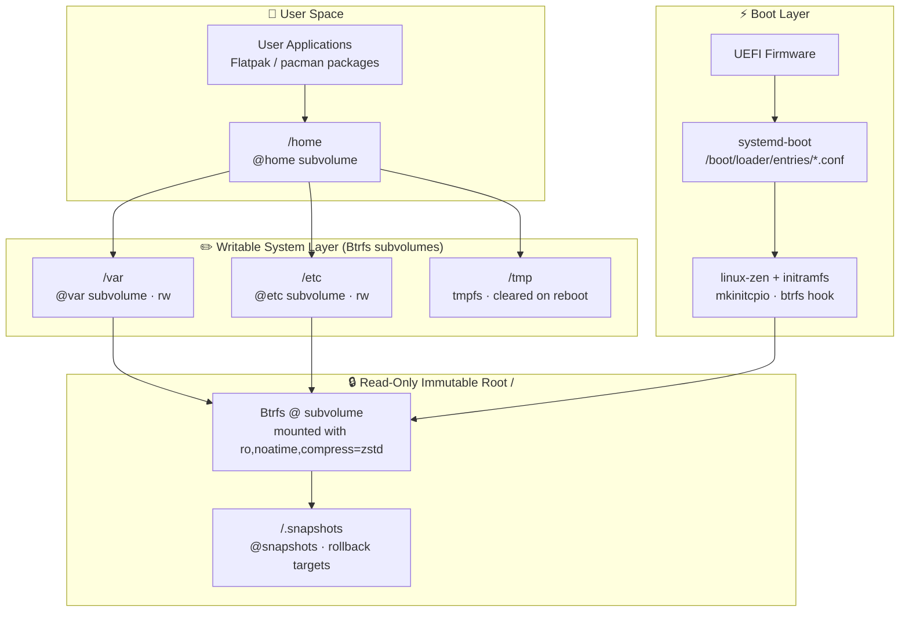
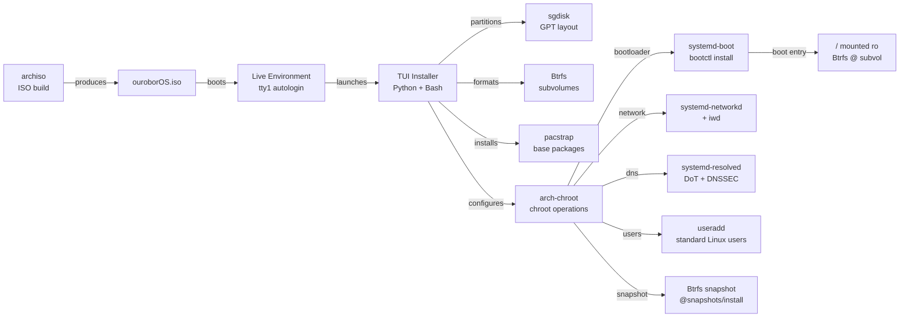

# ouroborOS — Architecture Overview

## Philosophy

ouroborOS takes its name from the ouroboros, the ancient symbol of a serpent consuming its own tail — representing **continuous self-renewal, self-containment, and cyclical evolution**. These principles guide every architectural decision:

- **Immutability**: The root filesystem is read-only. Changes are deliberate, atomic, and reversible.
- **Self-renewal**: Updates are atomic snapshots, not in-place mutations. Rollback is always one command away.
- **Minimal bloat**: Only what is needed is included. Every component must justify its presence.
- **systemd-native**: The entire user-space lifecycle — boot, networking, storage, identity — is managed through the systemd ecosystem.
- **ArchLinux base**: Rolling release model, bleeding-edge packages, pacman for package management.

---

## System Layer Diagram



---

## Component Relationships



---

## Core Components

| Component | Role |
|-----------|------|
| **archiso** | Live ISO build framework |
| **systemd-boot** | UEFI bootloader (replaces GRUB) |
| **Btrfs** | Filesystem with snapshots and subvolumes |
| **sgdisk** | GPT partitioning during install |
| **systemd-networkd** | Network configuration (wired + wireless) |
| **systemd-resolved** | DNS resolution with DoT support |
| **arch-chroot** | Chroot operations during installation |
| **systemd-firstboot** | First-boot configuration wizard |
| **mkinitcpio** | Initramfs generation with custom hooks |
| **systemd-repart** | *Future evaluation* — declarative partition layout |
| **systemd-homed** | *Future evaluation* — portable, encrypted home directories |

---

## Key Design Decisions

### 1. Immutability via Btrfs (not OSTree)
OSTree was evaluated but rejected due to poor pacman integration. Btrfs subvolumes + read-only root mount provides equivalent immutability with native ArchLinux tooling. See [immutability-strategy.md](./immutability-strategy.md).

### 2. systemd-boot over GRUB
GRUB adds complexity (grub.cfg, update-grub, theme management). systemd-boot is minimal, UEFI-native, and integrates with `bootctl` and kernel install hooks. Only UEFI systems are supported.

### 3. Installer written in Bash + Python
- **Bash**: Low-level operations (partitioning, mounting, pacstrap, chroot)
- **Python**: TUI logic (state machine, user input validation, config serialization)
- **Rich**: Terminal UI rendering (primary), whiptail as fallback

### 4. No NetworkManager
`systemd-networkd` + `iwd` (for WiFi) covers all networking needs without the overhead of NetworkManager.

---

## Repository Structure

```
ouroborOS/
├── CLAUDE.md                  # Claude Code project instructions
├── AGENTS.md                  # Agent knowledge base
├── IMPLEMENTATION_PLAN.md     # Phased implementation roadmap
├── README.md                  # Public project README
├── src/
│   ├── installer/             # Python FSM installer + Bash ops (core app)
│   ├── scripts/               # Build, flash, dev-env shell scripts
│   └── ouroborOS-profile/     # archiso profile (airootfs, efiboot, packages)
├── templates/                 # Default install config template for interactive mode
├── docs/                      # Architecture, build, installer documentation
├── tests/                     # Docker-based test infra + shell scripts
├── agents/                    # Agent role definitions (qa-tester, developer, etc.)
├── skills/                    # Domain skill docs (systemd, archiso, filesystem, etc.)
└── .github/workflows/         # CI workflows (lint, test, code-review, opencode)
```

---

## Related Documents

- [Immutability Strategy](./immutability-strategy.md)
- [systemd Integration](./systemd-integration.md)
- [Installer Phases](./installer-phases.md)
- [Build Process](../build/build-process.md)
- [Implementation Plan](../../IMPLEMENTATION_PLAN.md)
