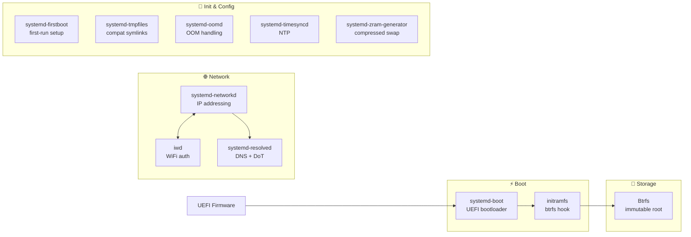
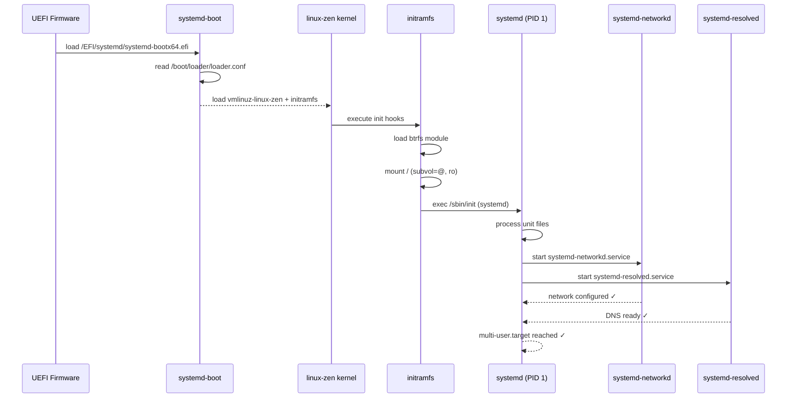

# systemd Integration

ouroborOS is built entirely around the systemd ecosystem. This document describes each systemd component used, its role, and its configuration within the project.

---

## systemd Ecosystem Map



---

## Boot Sequence



> **Note:** systemd-networkd, systemd-resolved, and generators start *before* `/etc` is mounted from `@etc`. Essential files are mirrored to `@` by the installer's `_write_systemd_enables_to_root()` function.

---

## Bootloader: systemd-boot

**Package:** `systemd` (included)
**Role:** UEFI bootloader, replaces GRUB entirely.

### Configuration layout
```
/boot/
├── EFI/
│   └── systemd/
│       └── systemd-bootx64.efi
├── loader/
│   ├── loader.conf          ← global bootloader config
│   └── entries/
│       ├── 01-ouroborOS.conf        ← default boot entry
│       └── 02-ouroborOS-fallback.conf
└── vmlinuz-linux-zen
└── initramfs-linux-zen.img
```

### loader.conf
```ini
default  01-ouroborOS.conf
timeout  3
console-mode max
editor   no
```

### Boot entry (01-ouroborOS.conf)
```ini
title   ouroborOS
linux   /vmlinuz-linux-zen
initrd  /intel-ucode.img       # or /amd-ucode.img (auto-detected)
initrd  /initramfs-linux-zen.img
options root=UUID=XXXX rootflags=subvol=@,ro loglevel=4
```

**Installation:** `bootctl install` during installer post-config phase.
**UEFI NVRAM entry:** `efibootmgr` from the host (chroot cannot write real NVRAM variables).
**Updates:** `bootctl update` via the `ouroboros-upgrade` wrapper or manual execution.

---

## Network: systemd-networkd + iwd

**Role:** Replaces NetworkManager. Handles wired and wireless networking declaratively.

### Wired (DHCP)
```ini
# /etc/systemd/network/20-wired.network
[Match]
Name=en*

[Network]
DHCP=yes
```

### Wireless (iwd backend)
```ini
# /etc/systemd/network/25-wireless.network
[Match]
Name=wl*

[Network]
DHCP=yes
IgnoreCarrierLoss=3s
```

**iwd** manages WiFi authentication; networkd manages addressing.

```ini
# /etc/iwd/main.conf
[General]
EnableNetworkConfiguration=false   # networkd handles this
```

**Units to enable:**
```
systemctl enable systemd-networkd.service
systemctl enable iwd.service
```

> **Important:** `.network` files and unit enable symlinks must exist on BOTH `@etc` AND `@` subvolumes. The installer's `_write_systemd_enables_to_root()` handles this.

---

## DNS: systemd-resolved

**Role:** Local DNS stub resolver with DoT (DNS-over-TLS) support.

```ini
# /etc/systemd/resolved.conf
[Resolve]
DNS=1.1.1.1#cloudflare-dns.com 9.9.9.9#dns.quad9.net
FallbackDNS=8.8.8.8
DNSSEC=yes
DNSOverTLS=opportunistic
Cache=yes
```

```bash
# Symlink for compatibility
ln -sf /run/systemd/resolve/stub-resolv.conf /etc/resolv.conf
```

---

## Swap: systemd-zram-generator

**Role:** Compressed RAM-based swap (no swap partition needed).

```ini
# /etc/systemd/zram-generator.conf
[zram0]
zram-size = ram / 2
compression-algorithm = zstd
swap-priority = 100
```

Enabled by default. The `zram-generator.conf` file must also be mirrored to the `@` subvolume for early-boot availability.

---

## Home Directories: systemd-homed

> **Status:** Not yet implemented. Planned for future evaluation. Currently uses standard `useradd` with `@home` Btrfs subvolume.

---

## Partitioning: systemd-repart

> **Status:** Not yet implemented. Planned for future evaluation. The installer currently uses `sgdisk` for GPT partition layout, which is simpler and sufficient for the single-disk use case.

---

## First Boot Configuration: systemd-firstboot

**Role:** Prompt for locale, timezone, hostname, and root password on first real boot (or via installer).

```bash
systemd-firstboot \
  --locale=en_US.UTF-8 \
  --locale-messages=en_US.UTF-8 \
  --keymap=us \
  --timezone=UTC \
  --hostname=ouroboros \
  --root-password-hashed="$6$..."
```

Used by the installer to pre-seed system configuration before handing off to user.

---

## Chroot: arch-chroot

**Role:** Used during installation to execute operations inside the target system.

The installer uses `arch-chroot` (from the `arch-install-scripts` package) wrapped in an `in_chroot()` function:

```bash
in_chroot() {
    arch-chroot "$TARGET" "$@"
}
```

`arch-chroot` was chosen over `systemd-nspawn` for simplicity — we only need to run commands inside the mounted tree, not a full isolated container. A future version may evaluate `nspawn` for pre-flight boot testing.

---

## Tmpfiles: systemd-tmpfiles

**Role:** Declarative creation of directories, symlinks, and files at boot. Used to handle read-only root compatibility.

```ini
# /usr/lib/tmpfiles.d/ouroborOS-compat.conf
# Create /usr/local from /var when root is read-only
L /usr/local - - - - /var/usrlocal
d /var/usrlocal 0755 root root -
```

---

## Package Updates: ouroboros-upgrade

**Role:** Wrapper script that replaces direct `pacman` usage. Creates a pre-upgrade Btrfs snapshot, remounts root read-write, runs pacman, then remounts read-only.

```bash
# Full system upgrade (snapshot created automatically)
sudo ouroboros-upgrade -Syu

# Install specific packages
sudo ouroboros-upgrade -S neovim tmux
```

> pacman pre/post upgrade hooks were evaluated but found useless — pacman checks filesystem writability BEFORE running hooks. This wrapper approach (like MicroOS `transactional-update`) is the correct solution.

---

## Unit Summary

| Unit | Enable at install | Purpose |
|------|------------------|---------|
| `systemd-networkd.service` | Yes | Network configuration |
| `systemd-resolved.service` | Yes | DNS resolution |
| `iwd.service` | Yes | WiFi management |
| `systemd-timesyncd.service` | Yes | NTP time sync |
| `fstrim.timer` | Yes | Weekly SSD TRIM |
| `systemd-oomd.service` | Yes | Out-of-memory daemon |

---

## Custom Installer Units (Live ISO)

During the live environment, these units manage the installer lifecycle:

```ini
# /etc/systemd/system/ouroborOS-installer.service
[Unit]
Description=ouroborOS Interactive Installer
After=network.target multi-user.target
ConditionPathExists=!/var/lib/ouroborOS-installed

[Service]
Type=oneshot
ExecStart=/usr/bin/ouroborOS-installer
StandardInput=tty
TTYPath=/dev/tty1
RemainAfterExit=yes

[Install]
WantedBy=multi-user.target
```
