# Análisis Comparativo: archiso · archinstall · ouroborOS

**Fecha:** 2026-04-12
**Versión analizada:** ouroborOS v0.4.0 · archiso master · archinstall master
**Autor:** Análisis automatizado con contexto del proyecto

---

## Resumen Ejecutivo

Este documento compara ouroborOS con dos proyectos upstream de Arch Linux:
**archiso** (framework de build de ISO) y **archinstall** (installer interactivo).
El objetivo es identificar mejoras, gaps y lecciones que ouroborOS puede adoptar
sin comprometer su filosofía de diseño inmutable, minimalista y systemd-native.

### Hallazgos clave

| Hallazgo | Severidad | Estado |
|----------|-----------|--------|
| `cryptsetup` ausente del ISO (requerido por `disk.sh` para LUKS) | 🔴 Crítico | Pendiente fix |
| Hyprland sin herramientas esenciales (screenshots, file manager) | 🟡 Gap funcional | Pendiente |
| Niri sin barra de estado, lock screen ni wallpaper setter | 🟡 Gap funcional | Pendiente |
| KDE con `kde-applications-meta` instala ~300 paquetes innecesarios | 🟡 Bloat | Pendiente optimizar |
| `os-release` desactualizado (0.1.0 vs 0.4.3) | 🟢 Menor | Pendiente fix |
| Perfiles correctamente minimalistas vs upstream | ✅ Correcto | — |
| Exclusión de X11/GRUB/NM consistente con antipatrones | ✅ Correcto | — |

---

## Parte 1: ouroborOS — Visión General del Proyecto

### 1.1 Qué es ouroborOS

ouroborOS es una distribución Linux inmutable basada en ArchLinux con las siguientes
características definitorias:

- **Root filesystem read-only** montado via Btrfs subvolumen `@` con opción `ro`
- **Updates atómicos** via snapshots Btrfs + `our-pac` wrapper
- **Rollback en un comando** via `our-rollback`
+- **Stack 100% systemd-native**: boot, red, DNS, swap, contenedores, home dirs
+- **UEFI-only**, systemd-boot exclusivo (sin GRUB, sin Legacy BIOS)
+- **AUR containerizado** via `our-aur` + systemd-sysext
+- **Flatpak opt-in** via `our-flat`

### 1.2 Arquitectura del sistema instalado

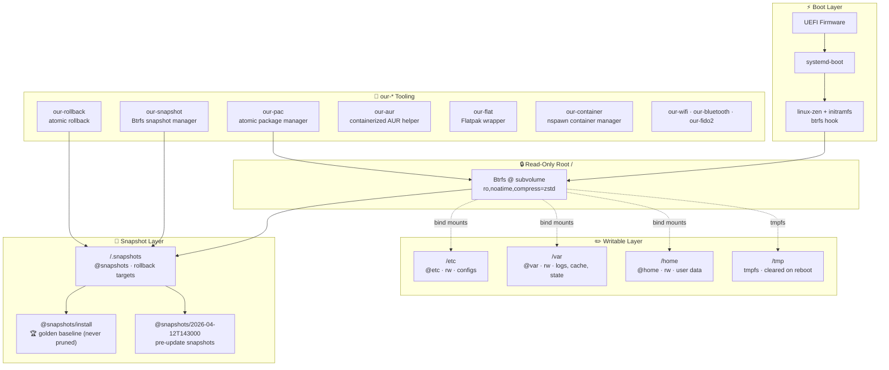

### 1.3 Flujo de update atómico

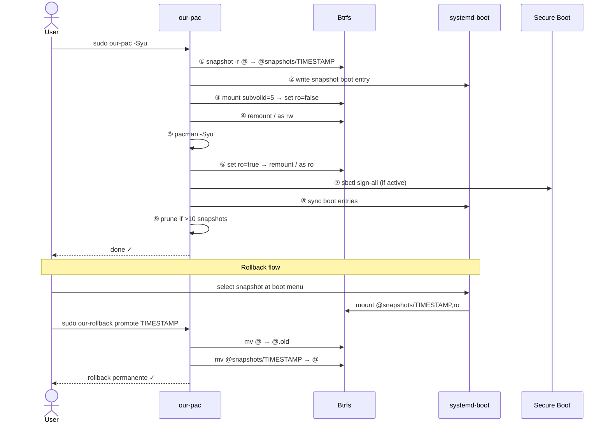

### 1.4 El Installer: FSM de 13 estados

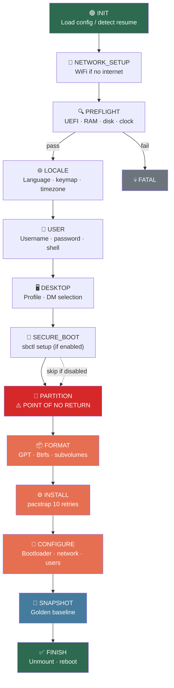

### 1.5 Métricas del proyecto

| Métrica | Valor |
|---------|-------|
| Código del installer | ~5,466 líneas (Python + Bash) |
| Ejecutables our-* | ~5,700+ líneas (13 scripts Bash) |
| Total estimado | ~11,000+ líneas |
| Tests unitarios | 347 tests, ≥93% coverage |
| Paquetes ISO | ~62 |
| Perfiles desktop | 5 (minimal, hyprland, niri, gnome, kde) |
| Workflows CI | 5 |
| Releases | 4 (v0.1.0 → v0.4.0) |
| Tiempo de desarrollo | ~6 días |

---

## Parte 2: archiso — Comparación del Framework de Build

### 2.1 ¿Qué es archiso?

archiso es el framework oficial de Arch Linux para construir imágenes ISO booteables.
Proporciona el comando `mkarchiso` que toma un **profile** (directorio con configuración)
y produce un ISO listo para flashear.

### 2.2 Estructura de un profile archiso

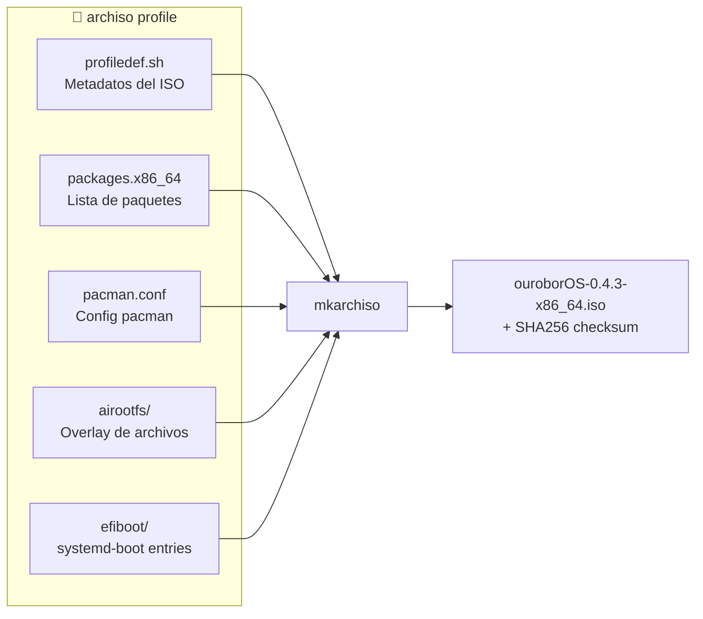

### 2.3 Comparación de profiles

| Aspecto | archiso `releng` | archiso `baseline` | ouroborOS |
|---------|------------------|--------------------|-----------|
| Propósito | ISO mensual de Arch | ISO mínima de Arch | Distro inmutable |
| Paquetes | ~130 | ~110 | ~62 |
| Boot modes | BIOS + UEFI | BIOS + UEFI (GRUB) | Solo UEFI |
| airootfs type | squashfs (xz) | **erofs** (lzma) | squashfs (zstd-15) |
| Kernel | linux | linux | linux-zen |
| Bootloader | systemd-boot + syslinux | GRUB | systemd-boot |

### 2.4 Novedades de upstream que ouroborOS no usa

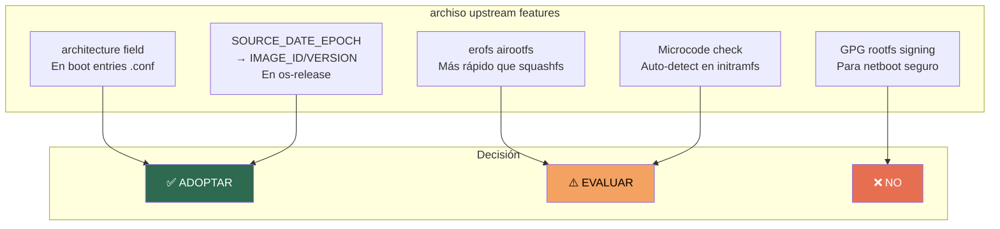

| Feature | Descripción | Conveniencia | Esfuerzo |
|---------|-------------|--------------|----------|
| `erofs` | Filesystem read-only nativo del kernel, montaje más rápido | ⚠️ Evaluar | 1 línea en profiledef.sh |
| `architecture` en entries | Campo para filtrar boot entries por arch | ✅ Adoptar | Agregar a .conf files |
| Microcode en initramfs | No copiar ucode separado si ya está en initramfs | ⚠️ Evaluar | Medio |
| GPG signing de rootfs | Firma del airootfs.sfs | ❌ No usa netboot | — |
| SOURCE_DATE_EPOCH → os-release | Inyectar IMAGE_ID/VERSION en os-release | ✅ Adoptar | Bajo |

### 2.5 Lo que ouroborOS hace mejor que archiso

| Feature | archiso | ouroborOS |
|---------|---------|-----------|
| Installer TUI/FSM | Ninguno | 13 estados con checkpoints |
| Desktop profiles | Ninguno | 5 perfiles con AUR lazy |
| Secure Boot | No | sbctl integrado |
| AUR helper | No | our-aur containerizado |
| SSH en live ISO | No | Servidor SSH activo |
| Serial console | No | ttyS0 configurado |
| Unattended YAML | No | Config discovery multi-source |

---

## Parte 3: Paquetes — Comparación Detallada

### 3.1 Bug crítico: `cryptsetup` ausente

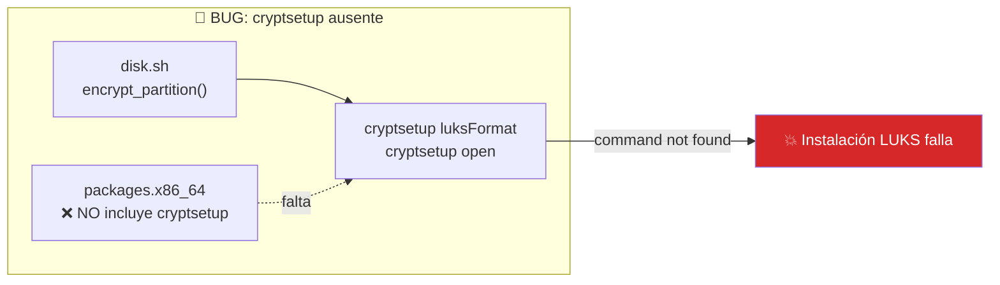

**`disk.sh` invoca `cryptsetup` directamente en el live ISO**, pero `cryptsetup`
no está en `packages.x86_64`. Cualquier instalación con `use_luks: true` falla con
`command not found: cryptsetup`.

**Fix:** Agregar `cryptsetup` a `packages.x86_64`.

### 3.2 Paquetes recomendados para agregar

| Paquete | Peso | Justificación |
|---------|------|---------------|
| **`cryptsetup`** | ~2 MB | **BUG** — requerido por `disk.sh` para LUKS |
| **`pciutils`** | ~1 MB | `lspci` esencial para debug de hardware headless via SSH |
| **`usbutils`** | ~0.5 MB | `lsusb` para diagnóstico de FIDO2 tokens y Bluetooth |
| **`diffutils`** | ~0.3 MB | `diff` usado implícitamente por muchos scripts |

**Costo total:** ~4 MB. ISO pasa de ~800 MB a ~804 MB.

### 3.3 Paquetes cuestionables en ouroborOS (considerar quitar)

| Paquete | Peso | Problema | Veredicto |
|---------|------|----------|-----------|
| `linux-zen-headers` | ~30 MB | Solo sirve para DKMS en el sistema instalado. Ya se instala via pacstrap | **Quitar del ISO** |
| `flatpak` | ~15 MB | No funciona en el live ISO (sin persistencia). Se instala post-install on-demand | **Quitar del ISO** |

**Ahorro:** ~45 MB. ISO pasaría de ~800 MB a ~755 MB.

### 3.4 Paquetes de upstream correctamente rechazados

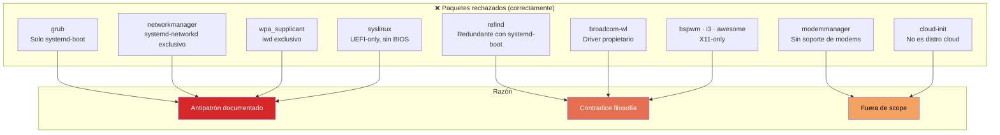

### 3.5 Comparación visual de tamaño

```
archiso releng:     ~130 paquetes   ~1.8 GB ISO
archiso baseline:   ~110 paquetes   ~1.2 GB ISO (erofs)
ouroborOS actual:    ~62 paquetes   ~800 MB ISO
ouroborOS optimizado: ~61 paquetes  ~755 MB ISO (-headers, -flatpak, +4 nuevos)
```

---

## Parte 4: archinstall vs ouroborOS — Desktop Profiles

### 4.1 Enfoques arquitectónicos

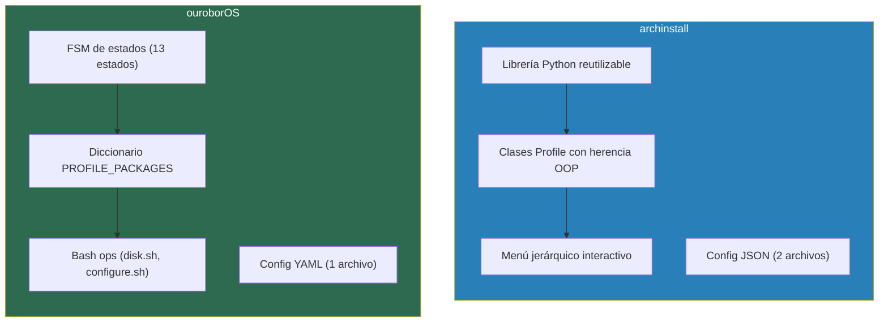

| Aspecto | archinstall | ouroborOS |
|---------|------------|-----------|
| Paradigma | Librería Python + OOP | FSM + diccionario estático |
| Configuración | JSON (config + credentials) | YAML (1 archivo) |
| Profiles | Clases Python con herencia | Dict `PROFILE_PACKAGES` |
| Extensibilidad | Nueva clase que hereda de `Profile` | Agregar entrada al dict |
| Interactividad | Menú jerárquico (DE → Greeter → GPU → Seat) | Menú plano (profile → DM auto) |
| Post-install hooks | `install()`, `post_install()`, `provision()` | `configure.sh` con branching |
| AUR packages | No gestiona | Lazy queue via `our-aur` |

### 4.2 Comparación perfil por perfil

#### 4.2.1 Hyprland

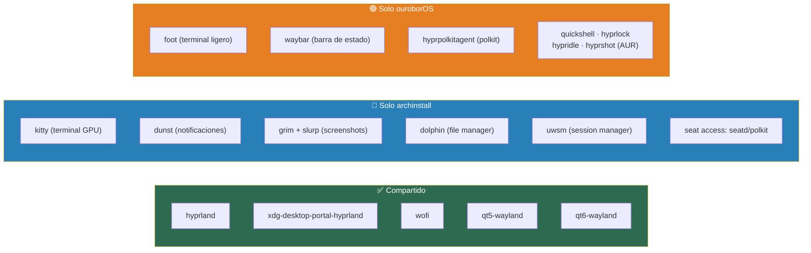

| Aspecto | archinstall | ouroborOS | Análisis |
|---------|------------|-----------|----------|
| Terminal | `kitty` (GPU) | `foot` (ligero) | Ambos válidos. `foot` más alineado con minimalismo |
| Notificaciones | `dunst` | **FALTA** | ⚠️ Gap — sin notificaciones |
| Screenshots | `grim` + `slurp` | **FALTA** | 🔴 Gap esencial |
| File manager | `dolphin` | **FALTA** | ⚠️ Gap — sin file manager |
| Polkit | `polkit-kde-agent` | `hyprpolkitagent` | ✅ ouroborOS usa nativo de Hyprland |
| Barra | — | `waybar` | ✅ ouroborOS la incluye |
| Session manager | `uwsm` | — | Menor — no crítico |
| AUR | — | 4 paquetes AUR lazy | ✅ Ventaja clara de ouroborOS |

**⚠️ Gaps del perfil Hyprland en ouroborOS:**
1. **`grim` + `slurp`** (screenshots) — ESENCIAL, sin esto no se pueden tomar capturas
2. **`dunst`** o **`swaync`** (notificaciones) — Necesario para un desktop funcional
3. **`dolphin`** o **`thunar`** (file manager) — El usuario necesita gestionar archivos

#### 4.2.2 Niri

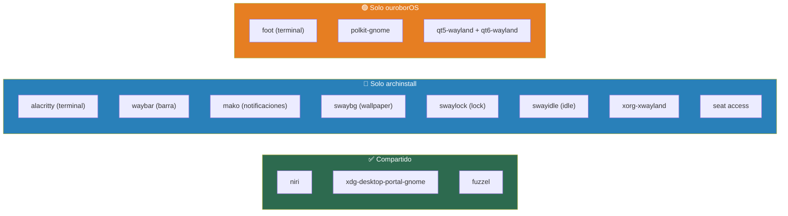

| Aspecto | archinstall | ouroborOS | Análisis |
|---------|------------|-----------|----------|
| Terminal | `alacritty` | `foot` | Ambos válidos |
| Barra de estado | `waybar` | **FALTA** | 🔴 Gap crítico — WM sin barra es spartan |
| Notificaciones | `mako` | **FALTA** | 🔴 Gap — sin notificaciones |
| Wallpaper | `swaybg` | **FALTA** | ⚠️ Gap — sin wallpaper setter |
| Lock screen | `swaylock` | **FALTA** | 🔴 Gap — sin lock screen |
| Idle daemon | `swayidle` | **FALTA** | ⚠️ Gap — sin gestión de idle |
| XWayland | `xorg-xwayland` | No | Decisión válida (Wayland-native) |
| Polkit | — | `polkit-gnome` | ✅ ouroborOS lo incluye |
| Qt Wayland | — | `qt5-wayland` + `qt6-wayland` | ✅ ouroborOS los incluye |
| Greeter | `lightdm` | `sddm` | Diferente pero funcional |

**🔴 Gaps significativos del perfil Niri en ouroborOS:**
1. **`waybar`** (barra de estado) — Un tiling WM sin barra es frustrante
2. **`swaylock`** o alternativa (lock screen) — Seguridad básica
3. **`swaybg`** o `swww` (wallpaper) — Experiencia visual
4. **`mako`** o `swaync` (notificaciones) — Desktop funcional

#### 4.2.3 GNOME — Prácticamente idéntico

| Paquete | archinstall | ouroborOS | Notas |
|---------|:-----------:|:---------:|-------|
| `gnome` | ✅ | ✅ | Meta-paquete que incluye todo |
| `gnome-tweaks` | ✅ | ✅ | Herramientas de customización |
| `xdg-user-dirs` | — | ✅ | Crea ~/Documents, ~/Downloads etc. |
| Greeter | `gdm` | `gdm` (auto) | Igual |

**✅ Sin gaps.** Ambos perfiles son correctos y completos. GNOME como meta-paquete
ya incluye todo lo necesario.

#### 4.2.4 KDE Plasma — Diferencia de enfoque

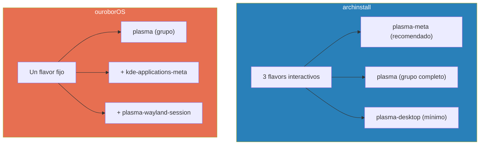

| Aspecto | archinstall | ouroborOS | Análisis |
|---------|------------|-----------|----------|
| Flavor selector | Sí (3 opciones) | No | archinstall ofrece flexibilidad |
| Paquete base | `plasma-meta` (default) | `plasma` (grupo) | Grupo instala más que meta |
| Apps adicionales | Ninguna | `kde-applications-meta` | ⚠️ Instala ~300 paquetes, ~1.5 GB |
| Wayland | Incluido en plasma | `plasma-wayland-session` explícito | Ya es dependencia de plasma |
| Greeter | `plasma-login-manager` | `plasma-login-manager` (plm) | Igual |

**⚠️ Problema en ouroborOS:** `kde-applications-meta` instala TODAS las apps KDE
incluyendo juegos, educación, ofimática, multimedia. ~1.5 GB de paquetes.
La recomendación del PHASE_2_PLAN sigue pendiente:

> *"Consider replacing with: `plasma-desktop dolphin konsole kate gwenview ark ffmpegthumbs`.
> Reduce de ~1.5 GB a ~400 MB."*

#### 4.2.5 Perfiles que archinstall tiene y ouroborOS no

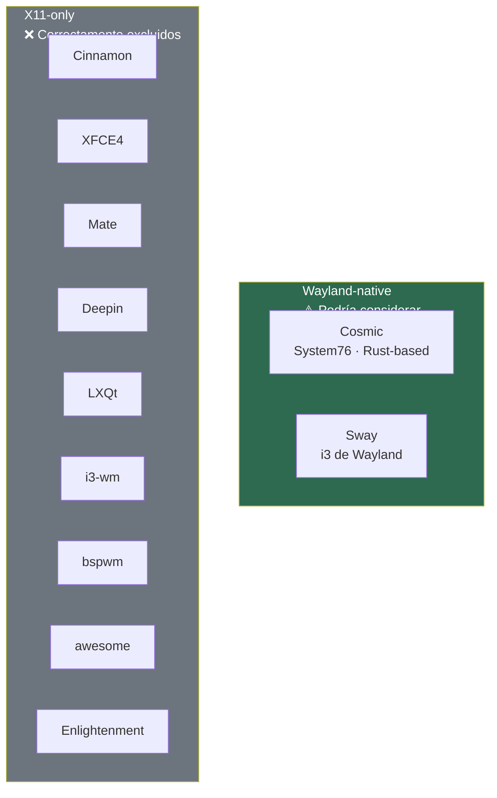

**Cosmic** (System76) es el único candidato real para un futuro perfil — es
Wayland-native, Rust-based, y está en activo desarrollo. Podría considerarse
para Phase 5+.

### 4.3 Comparación de features del installer

| Feature | archinstall | ouroborOS |
|---------|:-----------:|:---------:|
| GPU driver selection | ✅ | ❌ |
| Seat access (seatd/polkit) | ✅ | ❌ (implícito) |
| KDE flavor selector | ✅ | ❌ |
| Greeter selection | ✅ | ✅ |
| AUR support | ❌ | ✅ (lazy queue) |
| Flatpak support | ❌ | ✅ |
| Immutable root | ❌ | ✅ |
| Snapshots + Rollback | ❌ | ✅ |
| Container support | ❌ | ✅ |
| Secure Boot | ❌ | ✅ |
| WiFi/Bluetooth/FIDO2 | ❌ | ✅ |
| Unattended install | ✅ | ✅ |
| Resume/checkpoint | ❌ | ✅ |
| i18n (30+ idiomas) | ✅ | ❌ |
| X11 profiles | ✅ | ❌ (by design) |

---

## Parte 5: Veredicto y Recomendaciones

### 5.1 ¿Debería ouroborOS usar archinstall?

**No.** Razones fundamentales:

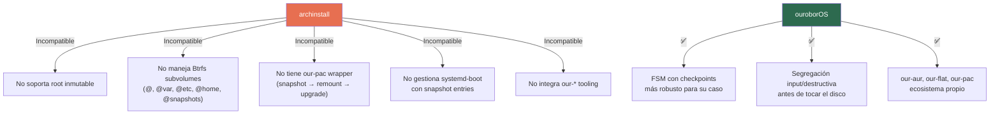

### 5.2 Acciones recomendadas (priorizadas)

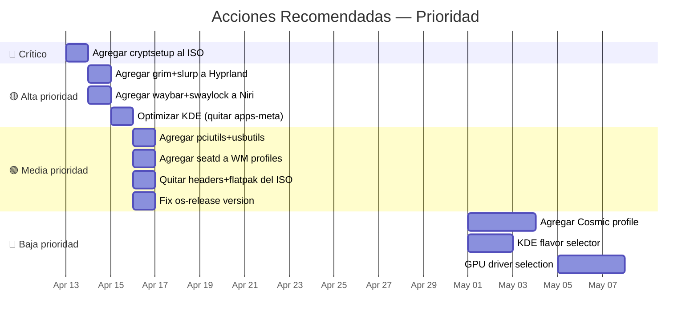

#### 🔴 Crítico (inmediato)

| # | Acción | Archivo | Detalle |
|---|--------|---------|---------|
| 1 | Agregar `cryptsetup` | `packages.x86_64` | Instalaciones con `use_luks: true` fallan sin esto |

#### 🟡 Alta prioridad (siguiente sprint)

| # | Acción | Archivo | Detalle |
|---|--------|---------|---------|
| 2 | Agregar `grim` + `slurp` | `desktop_profiles.py` | Hyprland: screenshots esenciales |
| 3 | Agregar `waybar` + `swaylock` + `swaybg` | `desktop_profiles.py` | Niri: WM sin barra/lock es spartan |
| 4 | Reemplazar `kde-applications-meta` | `desktop_profiles.py` | Usar `dolphin konsole kate gwenview ark ffmpegthumbs` (~400 MB vs ~1.5 GB) |

#### 🟢 Media prioridad

| # | Acción | Archivo | Detalle |
|---|--------|---------|---------|
| 5 | Agregar `pciutils` + `usbutils` + `diffutils` | `packages.x86_64` | Debug de hardware en live ISO |
| 6 | Agregar `seatd` a hyprland + niri | `desktop_profiles.py` | Seat access para WM |
| 7 | Quitar `linux-zen-headers` del ISO | `packages.x86_64` | Ya se instala via pacstrap (-30 MB) |
| 8 | Quitar `flatpak` del ISO | `packages.x86_64` | Se instala on-demand (-15 MB) |
| 9 | Fix `os-release` version | `airootfs/etc/os-release` | Usar SOURCE_DATE_EPOCH como upstream |

#### 🔵 Baja prioridad (Phase 5+)

| # | Acción | Detalle |
|---|--------|---------|
| 10 | Agregar Cosmic como 6to perfil | Wayland-native, Rust-based, en alza |
| 11 | KDE flavor selector | Opción meta/desktop como archinstall |
| 12 | GPU driver selection en installer | mesa/nvidia como opción del FSM |
| 13 | Evaluar `erofs` vs `squashfs` | 1 línea en profiledef.sh, más rápido |

### 5.3 Lecciones de archinstall para ouroborOS

| Lección | Aplicación |
|---------|-----------|
| Profiles más completos | Agregar screenshots, notificaciones, file manager a WM profiles |
| KDE flavor selector | Ofrecer meta vs desktop en vez del full apps-meta |
| Seat access explícito | Agregar `seatd` a perfiles de tiling WM |
| Custom profile hooks | El patrón `install()` + `post_install()` podría inspirar un mecanismo similar |
| i18n | El sistema gettext de archinstall es un buen modelo para Phase 4.3 |

### 5.4 Lecciones de archiso para ouroborOS

| Lección | Aplicación |
|---------|-----------|
| `erofs` como alternativa a squashfs | Evaluar — montaje más rápido, mejor ratio |
| `architecture` en boot entries | Agregar para futura compatibilidad aarch64 |
| `SOURCE_DATE_EPOCH` → os-release | Fix del bug de version desactualizado |
| Boot mode validation | Aprovechar la validación exhaustiva de mkarchiso |

---

## Apéndice A: Paquetes completos por perfil (comparación directa)

### Hyprland

| Paquete | archinstall | ouroborOS | Notas |
|---------|:-----------:|:---------:|-------|
| hyprland | ✅ | ✅ | Compositor |
| xdg-desktop-portal-hyprland | ✅ | ✅ | Portal |
| kitty | ✅ | — | Terminal GPU (arch: kitty, ouro: foot) |
| foot | — | ✅ | Terminal ligero |
| wofi | ✅ | ✅ | Launcher |
| waybar | — | ✅ | Barra de estado |
| dunst | ✅ | — | **⚠️ Falta en ouroborOS** |
| grim | ✅ | — | **🔴 Falta — screenshots** |
| slurp | ✅ | — | **🔴 Falta — screenshots** |
| dolphin | ✅ | — | **⚠️ Falta — file manager** |
| uwsm | ✅ | — | Session manager |
| polkit-kde-agent | ✅ | — | Polkit |
| hyprpolkitagent | — | ✅ | Polkit nativo de Hyprland |
| qt5-wayland | ✅ | ✅ | Qt5 Wayland |
| qt6-wayland | ✅ | ✅ | Qt6 Wayland |
| quickshell (AUR) | — | ✅ | Shell Qt6/QML |
| hyprlock (AUR) | — | ✅ | Screen locker |
| hypridle (AUR) | — | ✅ | Idle daemon |
| hyprshot (AUR) | — | ✅ | Screenshot tool |
| **Greeter** | sddm | sddm | Igual |

### Niri

| Paquete | archinstall | ouroborOS | Notas |
|---------|:-----------:|:---------:|-------|
| niri | ✅ | ✅ | Compositor |
| xdg-desktop-portal-gnome | ✅ | ✅ | Portal |
| alacritty | ✅ | — | Terminal (arch: alacritty, ouro: foot) |
| foot | — | ✅ | Terminal ligero |
| fuzzel | ✅ | ✅ | Launcher |
| waybar | ✅ | — | **🔴 Falta — barra** |
| mako | ✅ | — | **🔴 Falta — notificaciones** |
| swaybg | ✅ | — | **⚠️ Falta — wallpaper** |
| swaylock | ✅ | — | **🔴 Falta — lock screen** |
| swayidle | ✅ | — | **⚠️ Falta — idle** |
| xorg-xwayland | ✅ | — | XWayland (ouroborOS: Wayland-native) |
| polkit-gnome | — | ✅ | Polkit |
| qt5-wayland | — | ✅ | Qt5 Wayland |
| qt6-wayland | — | ✅ | Qt6 Wayland |
| **Greeter** | lightdm | sddm | Diferente |

### GNOME

| Paquete | archinstall | ouroborOS | Notas |
|---------|:-----------:|:---------:|-------|
| gnome | ✅ | ✅ | Meta-paquete |
| gnome-tweaks | ✅ | ✅ | Tweaks |
| xdg-user-dirs | — | ✅ | Crea directorios de usuario |
| **Greeter** | gdm | gdm | Igual |

### KDE Plasma

| Paquete | archinstall | ouroborOS | Notas |
|---------|:-----------:|:---------:|-------|
| plasma-meta (default) | ✅ | — | Meta curado (~1.5 GB) |
| plasma (grupo) | ✅ (opción) | ✅ | Grupo completo |
| plasma-desktop (mínimo) | ✅ (opción) | — | Solo el shell |
| kde-applications-meta | — | ✅ | **⚠️ ~300 apps, ~1.5 GB** |
| plasma-wayland-session | — | ✅ | Ya es dependencia de plasma |
| **Greeter** | plasma-login-manager | plasma-login-manager (plm) | Igual |
| **Flavor selector** | ✅ | ❌ | archinstall ofrece 3 opciones |

---

## Apéndice B: Tabla completa de paquetes ISO

### Paquetes en ouroborOS (~62)

| Categoría | Paquetes |
|-----------|----------|
| **Base** | base, linux-zen, linux-zen-headers, linux-firmware |
| **Filesystem** | btrfs-progs, dosfstools, util-linux, parted, gptfdisk |
| **Arch helpers** | arch-install-scripts, archiso, mkinitcpio-archiso, pacman-contrib, reflector |
| **Bootloader** | efibootmgr, edk2-shell, memtest86+-efi, intel-ucode, amd-ucode |
| **Red** | iwd, iw, wireless_tools, dhcpcd, openssh |
| **TUI** | dialog, libnewt |
| **Python** | python, python-yaml, python-rich, python-pyaml |
| **Texto** | less, nano, vim |
| **Shells** | zsh, fish |
| **System** | htop, rsync, wget, curl, git |
| **Dev/CI** | shellcheck, debootstrap |
| **Seguridad** | sbctl |
| **Apps** | flatpak |

### Paquetes recomendados a agregar

| Paquete | Justificación |
|---------|---------------|
| **cryptsetup** | BUG — requerido por disk.sh para LUKS |
| **pciutils** | `lspci` para debug de hardware |
| **usbutils** | `lsusb` para diagnóstico de dispositivos |
| **diffutils** | `diff` usado por scripts |

### Paquetes recomendados a quitar

| Paquete | Razón | Ahorro |
|---------|-------|--------|
| **linux-zen-headers** | Ya se instala via pacstrap | ~30 MB |
| **flatpak** | Se instala on-demand post-install | ~15 MB |

---

*Documento generado como parte del análisis comparativo ouroborOS v0.4.0.*