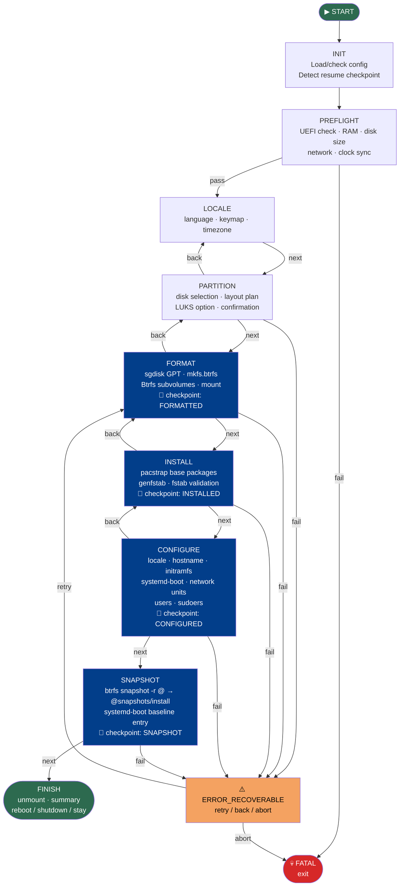

# Installer State Machine

## Overview

The ouroborOS installer is implemented as a linear finite state machine (FSM) in Python (`state_machine.py`). Each state corresponds to one installation phase. If the installer is interrupted, it can resume from the last completed checkpoint.

State flow:
```
INIT → PREFLIGHT → LOCALE → PARTITION → FORMAT → INSTALL
     → CONFIGURE → SNAPSHOT → FINISH
```

Error states:
```
Any state → ERROR_RECOVERABLE (retry) or FATAL (abort)
```

---

## State Machine Diagram



---

## State Enum (from `state_machine.py`)

```python
class State(Enum):
    INIT = auto()
    PREFLIGHT = auto()
    LOCALE = auto()
    PARTITION = auto()
    FORMAT = auto()
    INSTALL = auto()
    CONFIGURE = auto()
    SNAPSHOT = auto()
    FINISH = auto()
    ERROR_RECOVERABLE = auto()
    FATAL = auto()
```

---

## Checkpoint System

Checkpoints are saved to `/tmp/ouroborOS-checkpoints/` (on the live ISO):

```
/tmp/ouroborOS-checkpoints/
├── formatted.done          # FORMAT completed
├── installed.done          # INSTALL completed
├── configured.done         # CONFIGURE completed
├── snapshot.done           # SNAPSHOT completed
└── config.json             # Serialized InstallerConfig
```

Each checkpoint saves:
1. A `.done` marker file for the state name
2. The full `InstallerConfig` as `config.json` (for resume)

**Resume flow:** `--resume` flag → read `config.json` → find last `.done` checkpoint → skip to next state.

---

## Phase Details

### INIT
**Purpose:** Load configuration and detect if a previous installation can be resumed.

**Actions:**
- Parse CLI arguments (`--config`, `--resume`, `--validate-config`)
- Search for unattended config via `find_unattended_config()` (kernel cmdline → `/tmp` → `/run` → USB drives)
- If `--resume`: load last checkpoint and skip to that state
- If no config found: launch interactive TUI

---

### PREFLIGHT
**Purpose:** Validate that installation can proceed safely.

**Checks:**
- [ ] UEFI boot mode detected (`/sys/firmware/efi` exists)
- [ ] At least 2 GB RAM available
- [ ] At least one disk ≥ 20 GB detected
- [ ] Internet connectivity (ping archlinux.org or cached packages)
- [ ] System clock synchronized (timedatectl status)

**On failure:** Display diagnostic message, exit with `FATAL`. No changes made to disk.

---

### LOCALE
**Purpose:** Set regional settings for the installed system.

**User inputs:**
- Language / locale (e.g., `en_US.UTF-8`)
- Keyboard layout (e.g., `us`, `es`, `de`)
- Timezone (e.g., `America/New_York`)

**Rollback:** N/A (no disk changes).

---

### PARTITION
**Purpose:** Define disk layout without writing to disk yet.

**User inputs:**
- Target disk selection
- LUKS encryption? (optional)

**Actions:**
- Display disk overview (`lsblk`, `fdisk -l`)
- Show proposed partition table (dry-run)
- **Confirmation required before proceeding**

**Rollback:** N/A (no changes until FORMAT phase).

---

### FORMAT
**Purpose:** Write partition table and create filesystems.

**Actions:**
1. Write GPT with `sgdisk`
2. Format ESP: `mkfs.fat -F32`
3. Format root: `mkfs.btrfs -L ouroborOS`
4. Create Btrfs subvolumes: `@`, `@var`, `@etc`, `@home`, `@snapshots`
5. Mount subvolumes with correct options (see [immutability-strategy.md](../architecture/immutability-strategy.md))
6. Generate fstab

**Rollback:** Wipe partition table with `sgdisk --zap-all`.

**Checkpoint saved:** `FORMATTED`

---

### INSTALL
**Purpose:** Install base system packages into the mounted target.

**Actions:**
1. Install base packages via `pacstrap /mnt` (packages from `packages.x86_64`)
2. Generate fstab: `genfstab -U /mnt >> /mnt/etc/fstab`
3. Validate fstab for `ro` flag on root subvolume

**Rollback:** Unmount and reformat (return to FORMAT phase).

**Checkpoint saved:** `INSTALLED`

---

### CONFIGURE
**Purpose:** Configure the installed system (bootloader, network, users).

**Actions (via `arch-chroot`):**

1. **Locale & timezone:** `locale-gen`, `/etc/locale.conf`, `/etc/vconsole.conf`
2. **Hostname:** `/etc/hostname`
3. **Initramfs:** `mkinitcpio -P` with btrfs hook
4. **Bootloader:** `bootctl install` + EFI boot entry via `efibootmgr` (from host)
5. **Microcode:** Auto-detect CPU vendor → install `intel-ucode` or `amd-ucode`
6. **Network:** Enable `systemd-networkd`, `systemd-resolved`, `iwd`
7. **Immutable root:** `_write_systemd_enables_to_root()` — mirror essential systemd files to `@` subvolume
8. **User creation:** `useradd` with hashed password, wheel group
9. **Journal:** Mask `/var/log/journal` on `@` to prevent FAILED socket

**Rollback:** Return to INSTALL phase.

**Checkpoint saved:** `CONFIGURED`

---

### SNAPSHOT
**Purpose:** Create the baseline immutable snapshot of the clean install.

**Actions:**
```bash
btrfs subvolume snapshot -r /mnt/@ /mnt/.snapshots/install
```

This snapshot is the **golden baseline** — always available for rollback.

Boot entry written to `/boot/loader/entries/`.

---

### FINISH
**Purpose:** Clean up and present completion to user.

**Actions:**
1. Unmount all filesystems in reverse order
2. Display installation summary
3. Execute `post_install_action`: **reboot** (default), **shutdown**, or **stay**

---

## TUI Layer

The TUI is implemented in `tui.py` using **Rich** as the primary backend with **whiptail** as fallback.

- **Rich:** Rich console, progress bars, panels, tables
- **Whiptail:** Fallback if Rich is not available

All TUI functions return dicts — they never mutate global state. The FSM is independent of the UI, allowing unit testing of state logic without UI and unattended (headless) installation by bypassing TUI entirely.

---

## Configuration Object

The installer uses nested dataclasses from `config.py`:

```python
@dataclass
class InstallerConfig:
    disk: DiskConfig           # device, use_luks, btrfs_label, swap_type
    locale: LocaleConfig       # locale, keymap, timezone
    network: NetworkConfig     # hostname, enable_networkd, enable_iwd, enable_resolved
    user: UserConfig           # username, password_hash, groups, shell
    # Runtime state (not persisted to YAML):
    install_target: str        # mount point (default: /mnt)
    extra_packages: list[str]  # additional packages
    enable_luks: bool
    unattended: bool
    post_install_action: str   # "reboot" | "shutdown" | "none"
```

See [configuration-format.md](./configuration-format.md) for the full YAML schema.

---

## Progress Tracking

| State | Progress Range | Label |
|-------|---------------|-------|
| INIT | 0–5% | Iniciando |
| PREFLIGHT | 5–10% | Verificando requisitos |
| LOCALE | 10–20% | Configurando idioma |
| PARTITION | 20–30% | Seleccionando disco |
| FORMAT | 30–45% | Preparando disco |
| INSTALL | 45–70% | Instalando paquetes |
| CONFIGURE | 70–90% | Configurando sistema |
| SNAPSHOT | 90–95% | Creando snapshot |
| FINISH | 95–100% | Finalizando |

---

## Error Handling

| Error Type | Recovery Strategy |
|------------|------------------|
| Preflight failure | Exit with `FATAL`, show diagnostic |
| Disk write error | Transition to `ERROR_RECOVERABLE` |
| pacstrap failure | Retry up to 3x, then `ERROR_RECOVERABLE` |
| chroot command failure | Log to `/tmp/ouroborOS-install.log`, prompt retry |
| Bootloader install failure | Retry `bootctl install`, check ESP mount |

All errors are logged to `/tmp/ouroborOS-install.log` on the live system.
