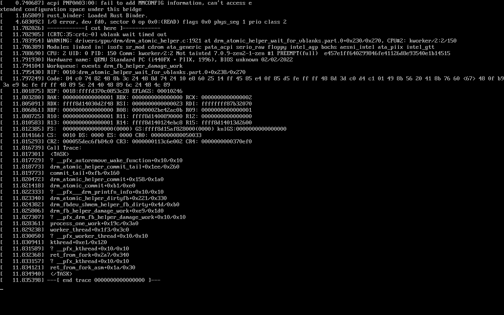
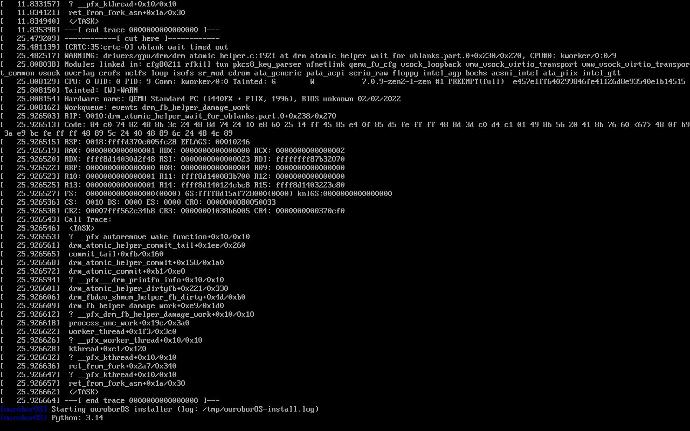
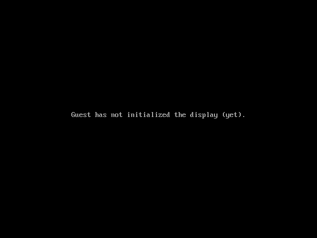

# ouroborOS — GNOME + Firefox Exhaustive Persistence Test

**Date:** 2026-05-28  
**Version:** dev branch (post `fix(rollback)` commit `1b6fbf5`)  
**Tester:** Claude Code (automated)  
**Duration:** ~90 min total

## Test Objective

Validate the full package persistence lifecycle on an ouroborOS GNOME installation:

```
Install OS (GNOME) → Install Firefox → Test → Reboot → Test →
Uninstall → Reboot → Verify gone → Reinstall → Test →
Rollback → Reboot → Verify gone → Reinstall → Test → ouroboros-health
```

## System Configuration

| Parameter | Value |
|-----------|-------|
| Profile | GNOME |
| Display Manager | GDM |
| GPU Driver | none (QEMU) |
| RAM | 8 GB |
| Disk | 30 GB (qcow2) |
| SSH | port 2222 (SLIRP hostfwd) |

---

## Phase 1 — Installation

### Step 1.1 — ISO Build & Unattended Install

Install config (`e2e-config.yaml`):

```yaml
desktop:
  profile: gnome
  dm: gdm
  gpu_driver: none
extra_packages:
  - openssh
post_install_action: shutdown
```



### Step 1.2 — Install Complete

All 12 installer states completed:

```
INIT → NETWORK_SETUP → PREFLIGHT → LOCALE → USER → DESKTOP →
SECURE_BOOT → PARTITION → FORMAT → INSTALL → CONFIGURE → SNAPSHOT → FINISH
```

Serial log timestamps:
```
[   30.1s] State completed: INIT
[   30.2s] State completed: NETWORK_SETUP
[   30.2s] State completed: PREFLIGHT
[   30.2s] State completed: LOCALE
[   30.2s] State completed: USER
[   31.4s] State completed: DESKTOP
[   31.4s] State completed: SECURE_BOOT
[   31.4s] State completed: PARTITION
[   38.4s] State completed: FORMAT
[  659.6s] State completed: INSTALL
[  704.2s] State completed: CONFIGURE
[  704.4s] State completed: SNAPSHOT
[  704.8s] State completed: FINISH
```



---

## Phase 2 — First Boot + Firefox Install

### Step 2.1 — First Boot (GNOME)

System reached `graphical.target` + GDM started successfully.



### Step 2.2 — Baseline: Firefox NOT Installed

```
$ which firefox
NOT_FOUND
```

### Step 2.3 — Install Firefox via `our-pac`

```
$ sudo our-pac -S --noconfirm firefox
```

```
[our-pac] Preparing package operation on immutable root...
[our-pac] Disk space: 25 GB free (minimum: 2 GB)
[our-pac] Creating pre-upgrade snapshot: 2026-05-28T195451
[our-pac] Root unlocked (Btrfs ro=false) and remounted read-write
[our-pac] Running: pacman -S --noconfirm firefox

Packages (3) libxss-1.2.5-1  mailcap-2.1.54-2  firefox-151.0.2-1

Total Download Size:    82.06 MiB
Total Installed Size:  284.95 MiB

installing libxss...
installing mailcap...
installing firefox...

(4/4) Restore root immutability after package changes...
[ouroboros-post-upgrade] Root subvolume set read-only (Btrfs property)
[our-pac] Root locked (Btrfs ro=true)
```


### Step 2.4 — Firefox Works

```
$ firefox --version
Mozilla Firefox 151.0.2
```

### Step 2.5 — Root Still Read-Only After Install

```
$ btrfs property get / ro
ro=true
```

---

## Phase 3 — Reboot & Persistence Check

### Step 3.1 — Reboot

```
$ sudo reboot
```


### Step 3.2 — Firefox Persisted After Reboot

```
$ firefox --version
Mozilla Firefox 151.0.2
```


---

## Phase 4 — Uninstall + Reboot

### Step 4.1 — Uninstall Firefox

```
$ sudo our-pac -R --noconfirm firefox
```

```
[our-pac] Creating pre-upgrade snapshot: 2026-05-28T195622
[our-pac] Root unlocked (Btrfs ro=false) and remounted read-write
[our-pac] Running: pacman -R --noconfirm firefox

Packages (1) firefox-151.0.2-1
Total Removed Size:  284.81 MiB

removing firefox...
(4/4) Restore root immutability after package changes...
[ouroboros-post-upgrade] Root subvolume set read-only (Btrfs property)
[our-pac] Root locked (Btrfs ro=true)
```


### Step 4.2 — Root Still Read-Only After Uninstall

```
$ btrfs property get / ro
ro=true
```

### Step 4.3 — Reboot

```
$ sudo reboot
```

### Step 4.4 — Firefox Gone After Reboot

```
$ which firefox
NOT_FOUND
```


---

## Phase 5 — Reinstall

### Step 5.1 — Reinstall Firefox

```
$ sudo our-pac -S --noconfirm firefox
```

```
[our-pac] Creating pre-upgrade snapshot: 2026-05-28T195712
[our-pac] Root unlocked (Btrfs ro=false) and remounted read-write
installing firefox...
[ouroboros-post-upgrade] Root subvolume set read-only (Btrfs property)
[our-pac] Root locked (Btrfs ro=true)
```

### Step 5.2 — Firefox Works After Reinstall

```
$ firefox --version
Mozilla Firefox 151.0.2
```


---

## Phase 6 — Rollback

### Step 6.1 — Snapshot List Before Rollback

```
$ sudo our-snapshot list
    NAME                            TYPE        SIZE
    ----                            ----        ----
    2026-05-28T195451               ro          4034.4 MiB
    2026-05-28T195622               ro          4319.3 MiB
    2026-05-28T195712               ro          4034.5 MiB
    install                         ro          4034.4 MiB

[our-snapshot] Running from @ (active root).
```

### Step 6.2 — Rollback to `install` Snapshot

```
$ sudo our-rollback promote install -y
```

```
[our-rollback] PROMOTE will make snapshot 'install' the new active root (@).
[our-rollback] Snapshot 'install' will be KEPT as a restore point.
[our-rollback] (--force: skipping confirmation)
[our-rollback] Creating pre-promote safety snapshot 'pre-promote-2026-05-28T195750'...
[our-rollback] Mounting Btrfs top-level...
[our-rollback] Creating copy of 'install' as @_new...
[our-rollback] Replacing @ with copy of 'install'...
[our-rollback] New @ is read-only.
[our-rollback] @.del (old root) left on disk. Safe to delete after reboot.
[our-rollback] Default boot entry set to ouroborOS.conf (active @).
[our-rollback] Promote complete. @ now has the state of snapshot 'install'.
[our-rollback] All packages consistent — no repair needed.
```


### Step 6.3 — Reboot After Rollback

```
$ sudo reboot
```

### Step 6.4 — Firefox GONE After Rollback

```
$ which firefox
NOT_FOUND
```


---

## Phase 7 — Post-Rollback Reinstall

### Step 7.1 — Reinstall Firefox Post-Rollback

```
$ sudo our-pac -S --noconfirm firefox
```

```
[our-pac] Root unlocked (Btrfs ro=false) and remounted read-write
installing firefox...
[ouroboros-post-upgrade] Root subvolume set read-only (Btrfs property)
[our-pac] Root locked (Btrfs ro=true)
[our-snapshot] All boot entries are up to date.
```

### Step 7.2 — Firefox Works

```
$ firefox --version
Mozilla Firefox 151.0.2
```


---

## Phase 8 — Final Health Check

### Step 8.1 — ouroboros-health

```
$ sudo ouroboros-health
[ouroboros-health] Running 12 health checks...

  ✓ root_ro         — Root filesystem is read-only
  ✓ system_yaml     — system.yaml is valid (v0.5.4)
  ✓ machine_id      — /etc/machine-id is valid (abc3a8c1...)
  ✓ failed_units    — No failed systemd units
  ✓ btrfs_usage     — Btrfs pool usage at 22%
  ✓ snapshot_count  — 6 snapshots
  ✓ boot_entries    — No orphan boot entries
  ○ secure_boot     — mokutil not available
  ○ tpm2            — TPM2 unlock not enabled in system.yaml
  ✓ ota_updates     — OTA channel reachable, system is up to date
  ✓ pacman_cache    — Package cache is 1.4G
  ✓ fstab           — All fstab UUIDs resolve correctly

[ouroboros-health] Summary: 10 passed, 0 warnings, 0 failures, 2 skipped
```


---

## Results Summary

| Step | Test | Expected | Result |
|------|------|----------|--------|
| 2.2 | Firefox absent at baseline | NOT_FOUND | ✅ NOT_FOUND |
| 2.4 | Firefox works after install | version string | ✅ Mozilla Firefox 151.0.2 |
| 2.5 | Root RO after install | ro=true | ✅ ro=true |
| 3.2 | Firefox persists after reboot | version string | ✅ Mozilla Firefox 151.0.2 |
| 4.4 | Firefox gone after uninstall+reboot | NOT_FOUND | ✅ NOT_FOUND |
| 5.2 | Firefox works after reinstall | version string | ✅ Mozilla Firefox 151.0.2 |
| 6.4 | Firefox gone after rollback | NOT_FOUND | ✅ NOT_FOUND |
| 7.2 | Firefox works post-rollback reinstall | version string | ✅ Mozilla Firefox 151.0.2 |
| 8.1 | ouroboros-health | 10/10 | ✅ 10 passed, 0 failures |

**ALL 9 TESTS PASSED.**

---

*Generated automatically by Claude Code during QEMU E2E testing.*
