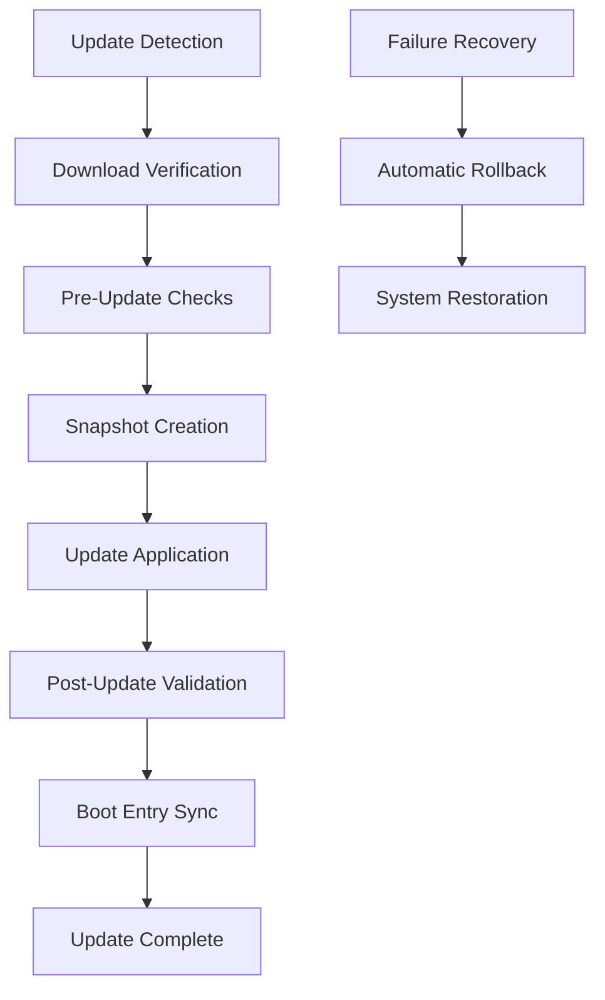

import { Tabs, TabItem } from '@astrojs/starlight/components';

# ouroboros-update — OTA Updates

`ouroboros-update` is ouroborOS's sophisticated over-the-air (OTA) update system that provides secure, atomic system updates with automatic rollback capabilities. It transforms system updates from risky, disruptive operations into seamless, reliable processes that maintain system integrity throughout the update lifecycle.

## What is ouroboros-update?

`ouroboros-update` brings mobile-grade update management to the desktop Linux world. Instead of traditional package-by-package updates that can leave systems in inconsistent states, it provides holistic, atomic updates with comprehensive safety features.

```bash
# Traditional update - risky and disruptive
sudo pacman -Syu          # Updates packages, can break dependencies
# System may be left in inconsistent state

# ouroboros-update - safe and atomic
ouroboros-update apply    # Creates snapshot, applies all updates atomically
# System remains consistent throughout
```

## Core Architecture

### **Update Phases**


### **Update Categories**
1. **Security Updates**: Critical security patches applied immediately
2. **Feature Updates**: Major version updates with user notification
3. **Maintenance Updates**: Bug fixes and performance improvements
4. **Optional Updates**: Experimental features and new packages

```yaml
# Update categories configuration
update_categories:
  security:
    priority: "critical"
    auto_apply: true
    require_confirmation: false
  
  feature:
    priority: "high"
    auto_apply: false
    require_confirmation: true
  
  maintenance:
    priority: "medium"
    auto_apply: true
    require_confirmation: false
  
  optional:
    priority: "low"
    auto_apply: false
    require_confirmation: true
```

## Basic Usage

### **Update Operations**
```bash
# Check for available updates
ouroboros-update check

# Apply all available updates
ouroboros-update apply

# Apply specific update category
ouroboros-update apply --category security

# Dry run to preview updates
ouroboros-update apply --dry-run

# Force update (bypass safety checks)
ouroboros-update apply --force
```

### **Update Management**
```bash
# Pause automatic updates
ouroboros-update pause

# Resume automatic updates
ouroboros-update resume

# Cancel pending update
ouroboros-update cancel

# Update scheduling
ouroboros-update schedule --time "02:00" --day "sunday"
```

### **Update Status**
```bash
# Show update status
ouroboros-update status

# Show update history
ouroboros-update history --limit 10

# Show pending updates
ouroboros-update pending

# Show update progress
ouroboros-progress
```

## Advanced Operations

### **Update Channels**
```bash
# Switch to stable channel
ouroboros-update channel --set stable

# Switch to beta channel
ouroboros-update channel --set beta

# Switch to development channel
ouroboros-update channel --set development

# Show current channel
ouroboros-update channel --show
```

### **Update Rollback**
```bash
# Rollback to previous version
ouroboros-update rollback

# Rollback to specific version
ouroboros-update rollback --version 1.2.0

# Preview rollback
ouroboros-update rollback --preview

# Cancel rollback
ouroboros-update rollback --cancel
```

### **Update Verification**
```bash
# Verify update integrity
ouroboros-update verify

# Check signature validity
ouroboros-update verify --signatures

# Validate package dependencies
ouroboros-update verify --dependencies

# Test update in staging
ouroboros-update verify --staging
```

## Configuration Options

### **Configuration File**
```yaml
# /etc/ouroborOS/update.conf
update:
  auto_check: true
  auto_apply: false
  check_interval: 3600  # 1 hour
  
  channels:
    stable: "https://updates.ouroboros.la/stable"
    beta: "https://updates.ouroboros.la/beta"
    development: "https://updates.ouroboros.la/dev"
    
  categories:
    security:
      auto_apply: true
      require_confirmation: false
      maintenance_window: "02:00-04:00"
    
    feature:
      auto_apply: false
      require_confirmation: true
      rollout_percentage: 10
    
  rollback:
    enabled: true
    automatic: true
    max_rollback_attempts: 3
    rollback_timeout: 300  # seconds
    
  download:
    parallel_downloads: 4
    cache_size: "10G"
    verify_signatures: true
    
  notification:
    enabled: true
    email: "admin@domain.com"
    desktop: true
    system: true
```

### **Global Settings**
```bash
# Set update channel
ouroboros-update config set channel stable

# Configure auto-update behavior
ouroboros-update config set auto_apply false

# Set maintenance window
ouroboros-update config set maintenance_window "02:00-04:00"

# Show current configuration
ouroboros-update config show
```

## Update Process

### **Update Detection**
```bash
# Check for updates
ouroboros-update check

# Show available updates
ouroboros-update list

# Filter updates by category
ouroboros-update list --category security

# Show update details
ouroboros-update info 1.3.0
```

### **Update Download**
```bash
# Download update packages
ouroboros-update download

# Download specific version
ouroboros-update download --version 1.3.0

# Verify downloaded packages
ouroboros-update verify --downloaded

# Clear download cache
ouroboros-update clean --cache
```

### **Update Application**
```bash
# Apply update with pre-flight checks
ouroboros-update apply

# Apply update with custom options
ouroboros-update apply \
  --preserve-configs \
  --create-backup \
  --notify-admin

# Monitor update progress
ouroboros-update monitor
```

## Security Features

### **Update Verification**
```bash
# Verify update signatures
ouroboros-update verify --signatures

# Check update integrity
ouroboros-update verify --integrity

# Validate package dependencies
ouroboros-update verify --dependencies

# Secure boot integration
ouroboros-update verify --secure-boot
```

### **Update Authentication**
```bash
# Check update authenticity
ouroboros-update auth verify

# Update GPG keys
ouroboros-update auth update-keys

# Revoke compromised keys
ouroboros-update auth revoke-key
```

### **Update Encryption**
```bash
# Encrypt update packages
ouroboros-update encrypt --package nginx

# Decrypt update packages
ouroboros-update decrypt --package nginx

# Manage encryption keys
ouroboros-update encrypt manage-keys
```

## Integration with System

### **Package Manager Integration**
```bash
# Update coordination with package manager
our-pac upgrade  # Triggers ouroboros-update check

# Package validation during update
our-pac update-check

# Post-update verification
our-pac verify --after-update
```

### **Snapshot Integration**
```bash
# Create snapshot before update
our-snapshot create pre-update

# Update with snapshot backup
ouroboros-update apply --backup-snapshot

# Rollback using snapshots
our-rollback now
```

### **Service Management**
```bash
# Service coordination during updates
systemctl ouroboros-update.service

# Service state preservation
ouroboros-update apply --preserve-services

# Service restart coordination
ouroboros-update apply --services="restart"
```

## Automation Scripts

### **Automatic Updates**
```bash
#!/bin/bash
# /etc/ouroborOS/auto-update.sh

# Enable automatic updates for security patches
ouroboros-update config set security.auto_apply true

# Schedule security updates for maintenance window
ouroboros-update schedule --time "02:00" --day "sunday"

# Check for updates
ouroboros-update check

# Apply security updates automatically
if [ $(ouroboros-update pending --category security) -gt 0 ]; then
    ouroboros-update apply --category security
    our-snapshot create post-security-update
fi
```

### **Update Testing**
```bash
#!/bin/bash
# /etc/ouroborOS/update-testing.sh

# Create testing environment
ouroboros-update stage --create

# Apply update in staging
ouroboros-update apply --staging

# Test update functionality
systemctl status nginx
systemctl status postgresql

# Promote to production if successful
ouroboros-update stage --promote
```

### **Update Monitoring**
```bash
#!/bin/bash
# /etc/ouroborOS/update-monitor.sh

# Monitor update progress
ouroboros-update monitor --continuous

# Alert on update failures
if ouroboros-update status --failed | grep -q "FAILED"; then
    mail -s "Update Failed" admin@domain.com << EOF
Update process encountered errors:
$(ouroboros-update status --failed)
EOF
fi

# Generate update report
ouroboros-update report --daily --output /var/log/update-report-$(date +%Y%m%d).html
```

## Monitoring and Reporting

### **Update Monitoring**
```bash
# Monitor update progress
ouroboros-update monitor

# Show update statistics
ouroboros-update stats

# Track update success rate
ouroboros-update track --success-rate
```

### **Update Reporting**
```bash
# Generate daily update report
ouroboros-update report --daily --format html

# Generate weekly update summary
ouroboros-update report --weekly --format pdf

# Custom update report
ouroboros-update report --custom --metrics success,failure,size
```

### **Performance Analysis**
```bash
# Update performance metrics
ouroboros-update performance --analyze

# Download speed analysis
ouroboros-update performance --download-speed

# Update time analysis
ouroboros-update performance --update-time
```

## Troubleshooting

### **Common Issues**
```bash
# Update download fails
ouroboros-update diagnose --download

# Update application fails
ouroboros-update diagnose --apply

# Verification fails
ouroboros-update diagnose --verify

# Service conflicts
ouroboros-update diagnose --services
```

### **Update Recovery**
```bash
# Failed update recovery
ouroboros-update recovery --automatic

# Manual rollback
ouroboros-update rollback --force

# Emergency recovery
ouroboros-update recovery --emergency
```

### **Debug Mode**
```bash
# Enable debug logging
ouroboros-update --debug apply

# Show detailed update information
ouroboros-update --verbose status

# Test update without applying
ouroboros-update --dry-run apply
```

## Best Practices

### **Update Strategy**
```bash
# Staged rollout for major updates
ouroboros-update rollout --percentage 10
ouroboros-update rollout --percentage 50
ouroboros-update rollout --percentage 100

# Maintenance window scheduling
ouroboros-update schedule --time "02:00-04:00" --day "sunday"

# Backup before major updates
our-snapshot create pre-major-update
```

### **Security Considerations**
```bash
# Always verify update signatures
ouroboros-update verify --signatures

# Test updates in staging first
ouroboros-update stage --test

# Monitor for suspicious updates
ouroboros-update monitor --security
```

### **Performance Optimization**
```bash
# Use parallel downloads
ouroboros-update config set parallel_downloads 4

# Cache update packages
ouroboros-update config set cache_size "10G"

# Schedule updates for off-peak times
ouroboros-update schedule --time "02:00" --day "sunday"
```

`ouroboros-update` represents the future of system updates for desktop Linux, providing the reliability and safety features found in mobile operating systems while maintaining the flexibility and power of desktop systems. With its atomic updates, automatic rollback capabilities, and comprehensive monitoring, it ensures that your system remains secure and up-to-date without risking stability.

<Tabs>
<TabItem label="Basic Updates">
```bash
# Basic update workflow
ouroboros-update check            # Check for updates
ouroboros-update apply           # Apply updates
ouroboros-update status          # Check status
ouroboros-update history         # View update history
```
</TabItem>
<TabItem label="Advanced Updates">
```bash
# Advanced update management
ouroboros-update channel stable   # Set update channel
ouroboros-update apply --category security  # Apply security updates
ouroboros-update rollback         # Rollback if needed
ouroboros-update schedule --time "02:00"  # Schedule updates
```
</TabItem>
</Tabs>