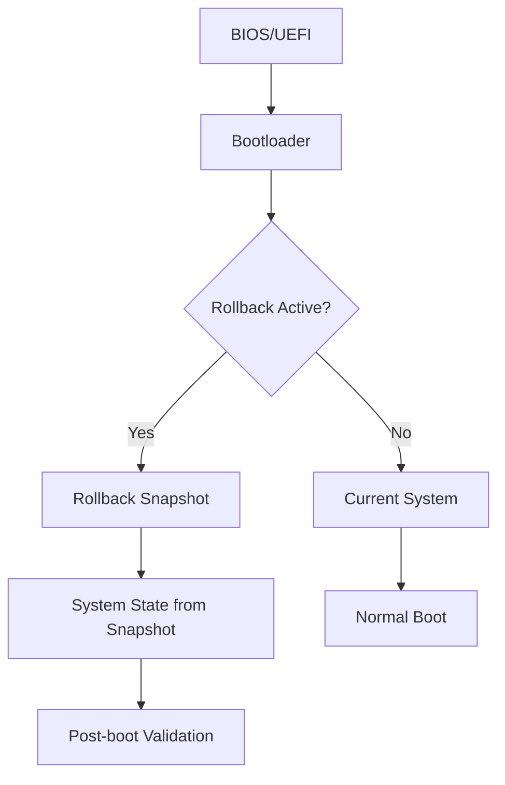

import { Tabs, TabItem } from '@astrojs/starlight/components';

# our-rollback — Rollback

`our-rollback` is ouroborOS's powerful system rollback tool that provides instant state transitions, allowing you to revert your system to any previous snapshot with a single command. It's the ultimate safety net for system changes, ensuring that even catastrophic failures can be resolved in seconds.

## What is our-rollback?

`our-rollback` transforms system recovery from a complex, time-consuming process into an instantaneous operation. Instead of hours of troubleshooting and manual fixes, you can revert to any known-good state in seconds, with full confidence that your system will be exactly as it was.

```bash
# Traditional recovery - hours of work
# 1. Boot from live media
# 2. Mount filesystems
# 3. Manual configuration fixes
# 4. Service restoration
# 5. Bootloader repair

# our-rollback - instant recovery
our-rollback now
# Reboot to previous stable state in seconds
```

## Rollback Types

### **1. One-Time Rollback (Now)**
A temporary rollback that lasts for one boot cycle. Perfect for testing changes or recovering from temporary issues.

```bash
# Set one-time rollback
our-rollback now

# Status check
our-rollback status

# Cancel one-time rollback
our-rollback undo
```

### **2. Permanent Rollback (Promote)**
A permanent rollback that makes the snapshot the new system state. Use this when you're confident in the rollback.

```bash
# Promote snapshot as new permanent state
our-rollback promote 2024-01-15T10:00:00

# Check promotion status
our-rollback status --promote
```

### **3. Status Rollback**
Check current rollback status and available options.

```bash
# Show current rollback status
our-rollback status

# Show detailed information
our-rollback status --verbose

# Show rollback history
our-rollback history
```

## Basic Usage

### **Rollback Operations**
```bash
# View available snapshots for rollback
our-rollback list

# Set one-time rollback
our-rollback now

# Set rollback to specific snapshot
our-rollback set 2024-01-15T10:00:00

# Cancel current rollback
our-rollback undo
```

### **Promotion Operations**
```bash
# Promote snapshot to permanent state
our-rollback promote 2024-01-15T10:00:00

# Preview promotion
our-rollback promote --preview 2024-01-15T10:00:00

# Check promotion status
our-rollback status --promote
```

### **Status and Information**
```bash
# Show current rollback status
our-rollback status

# Show rollback candidates
our-rollback candidates

# Show rollback history
our-rollback history

# Show detailed information
our-rollback info 2024-01-15T10:00:00
```

## Advanced Operations

### **Rollback Configuration**
```bash
# Configure rollback defaults
our-rollback config set auto-promote true
our-rollback config set safety-checks true

# View configuration
our-rollback config show

# Reset configuration
our-rollback config reset
```

### **Rollback Filtering**
```bash
# List snapshots from last 7 days
our-rollback list --since "7 days ago"

# List snapshots by category
our-rollback list --category upgrade

# List snapshots by size
our-rollback list --max-size 5G

# List only safe rollback candidates
our-rollback list --safe
```

### **Rollback Validation**
```bash
# Validate snapshot before rollback
our-rollback validate 2024-01-15T10:00:00

# Check system compatibility
our-rollback check-system 2024-01-15T10:00:00

# Verify rollback safety
our-rollback safety-check 2024-01-15T10:00:00
```

## Rollback Scenarios

### **System Update Recovery**
```bash
# Update fails - immediate rollback
sudo our-pac upgrade  # Update fails
sudo our-rollback now  # Immediate recovery
reboot                # System boots to previous state

# Permanent rollback after testing
sudo our-rollback promote stable-2024-01-15T10:00:00
```

### **Package Installation Failure**
```bash
# Install problematic package
sudo our-pac install broken-package  # System breaks

# Quick rollback
our-rollback now
reboot

# Alternative: Test in staging first
our-rollback set staging-snapshot
# Test package in staging environment
# If successful, promote; if not, rollback
```

### **Configuration Mistake**
```bash
# Incorrect configuration breaks system
# Edit /etc/important-config incorrectly

# Immediate rollback
our-rollback now
reboot

# Fix configuration properly
# Test with staging rollback
our-rollback set test-config
# Apply correct changes
our-rollback promote test-config
```

## Boot Process Integration

### **Bootloader Integration**
```bash
# Automatic bootloader entry creation
our-rollback now  # Creates temporary boot entry

# Bootloader entry management
our-rollback boot-list
our-rollback boot-remove 2024-01-15T09:00:00

# Bootloader repair
our-rollback boot-repair
```

### **Boot Process Flow**


## Rollback Safety Features

### **Pre-Rollback Checks**
```bash
# System compatibility check
our-rollback pre-check 2024-01-15T10:00:00

# Filesystem integrity check
our-rollback fs-check 2024-01-15T10:00:00

# Service availability check
our-rollback service-check 2024-01-15T10:00:00
```

### **Rollback Validation**
```bash
# Validate snapshot before applying
our-rollback validate 2024-01-15T10:00:00

# Check rollback safety
our-rollback safety-check 2024-01-15T10:00:00

# Test rollback in staging
our-rollback test 2024-01-15T10:00:00
```

### **Rollback Protection**
```bash
# Protect critical snapshots
our-rollback protect install recovery

# Remove protection
our-rollback unprotect manual-backup

# List protected snapshots
our-rollback list --protected
```

## Configuration Options

### **Configuration File**
```yaml
# /etc/ouroborOS/our-rollback.conf
rollback:
  auto_promote: false           # Auto-promote after successful boot
  safety_checks: true          # Enable pre-rollback checks
  snapshot_validation: true    # Validate snapshots before rollback
  boot_timeout: 30             # Boot timeout for rollback
  max_rollback_attempts: 3     # Maximum rollback attempts

logging:
  level: "info"
  file: "/var/log/our-rollback.log"
  rotate: "weekly"

notifications:
  email: "admin@ouroboros.la"
  webhook: "https://monitoring.example.com/webhook"
```

### **Global Settings**
```bash
# Set auto-promotion
our-rollback config set auto-promote true

# Enable safety checks
our-rollback config set safety-checks true

# Set boot timeout
our-rollback config set boot-timeout 60

# View current configuration
our-rollback config show
```

## Integration with System

### **Package Manager Integration**
```bash
# Automatic rollback after failed package operation
sudo our-pac upgrade
# If upgrade fails, automatically rollback
our-rollback auto-fallback

# Manual rollback after package operation
our-rollback now
sudo our-pac --reinstall broken-package
```

### **Service Management**
```bash
# Service rollback integration
sudo systemctl enable our-rollback.service
sudo systemctl start our-rollback-monitor.service

# Service health checks
our-rollback service-health-check
```

### **Monitoring Integration**
```bash
# Monitor rollback operations
our-rollback monitor --start

# Send rollback alerts
our-rollback alert --email admin@domain.com

# Log rollback events
our-rollback log --export /var/log/rollback-events.log
```

## Automation Scripts

### **Automated Rollback Policy**
```bash
#!/bin/bash
# /etc/ouroborOS/auto-rollback.sh

# Configure automatic rollback
our-rollback config set auto-promote true
our-rollback config set safety-checks true

# Monitor system health
while true; do
    if ouroboros-health check --critical; then
        our-rollback now
        echo "Critical system issue detected - initiating rollback"
        exit 1
    fi
    sleep 300  # Check every 5 minutes
done
```

### **Scheduled Rollback Testing**
```bash
#!/bin/bash
# /etc/ouroborOS/weekly-rollback-test.sh

# Test rollback capability weekly
our-rollback test latest
if [ $? -eq 0 ]; then
    echo "Rollback test successful"
else
    echo "Rollback test failed - manual intervention required"
    mail -s "Rollback Test Failure" admin@domain.com << EOF
Weekly rollback test failed. Manual investigation required.
EOF
fi
```

### **Emergency Rollback Script**
```bash
#!/bin/bash
# /usr/local/bin/emergency-rollback.sh

# Emergency rollback script
if [ "$1" = "--force" ]; then
    our-rollback now --force
    reboot
elif [ "$1" = "--safe" ]; then
    our-rollback now --safe
    reboot
else
    echo "Usage: $0 [--force|--safe]"
    exit 1
fi
```

## Troubleshooting

### **Common Issues**
```bash
# Rollback fails to boot
our-rollback repair-boot

# Rollback stuck in loop
our-rollback break-loop

# Snapshot validation fails
our-rollback revalidate 2024-01-15T10:00:00

# Bootloader corruption
our-rollback repair-bootloader
```

### **Rollback Failure Recovery**
```bash
# Manual rollback intervention
# Boot into live system
mount /dev/vda2 /mnt
chroot /mnt
our-rollback manual-rollback

# Emergency boot repair
our-rollback emergency-boot
```

### **Debug Mode**
```bash
# Enable debug logging
our-rollback --debug rollback now

# Show detailed rollback information
our-rollback --verbose status

# Test rollback without applying
our-rollback --dry-run rollback now
```

## Best Practices

### **Rollback Strategy**
```bash
# Create rollback points before major changes
our-rollback create-backup "Before major update"

# Test rollback in staging
our-rollback test-snapshot 2024-01-15T10:00:00

# Use one-time rollback for testing
our-rollback now
# Test changes
# If successful, promote; if not, reboot to undo
```

### **Rollback Maintenance**
```bash
# Regular snapshot cleanup
our-snapshot prune --keep 30

# Rollback configuration review
our-rollback config show

# Rollback capability testing
our-rollback test latest
```

### **Security Considerations**
```bash
# Protect rollback snapshots
our-rollback protect critical-snapshots

# Monitor rollback attempts
our-rollback audit --watch

# Secure rollback configuration
our-rollback config set require-auth true
```

`our-rollback` is the ultimate safety net for your system, providing instant recovery from any failure or mistake. With its powerful rollback capabilities, you can confidently make changes knowing that you can always revert to a known-good state in seconds.

<Tabs>
<TabItem label="Basic Rollback">
```bash
# Simple rollback workflow
our-rollback list                    # Show available snapshots
our-rollback now                     # Set one-time rollback
our-rollback status                  # Check status
reboot                              # System reverts to previous state
our-rollback undo                    # Cancel if needed
```
</TabItem>
<TabItem label="Advanced Rollback">
```bash
# Production rollback workflow
our-rollback safety-check stable-2024-01-15T10:00:00  # Check safety
our-rollback set stable-2024-01-15T10:00:00           # Set rollback
our-rollback promote stable-2024-01-15T10:00:00       # Make permanent after testing
our-rollback history                                    # Log the operation
```
</TabItem>
</Tabs>