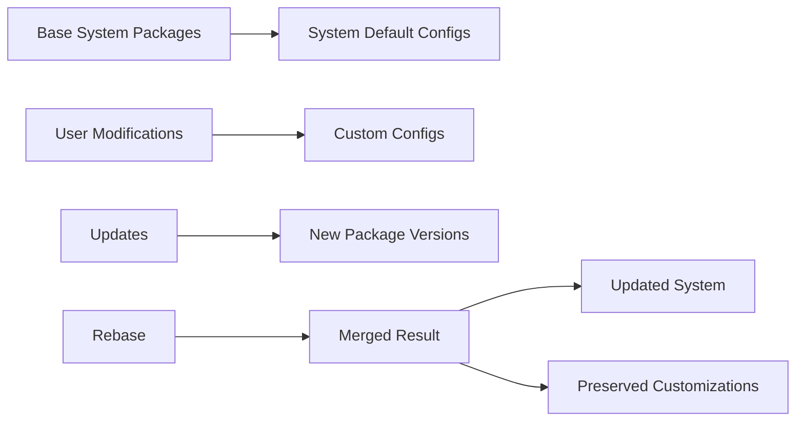

import { Tabs, TabItem } from '@astrojs/starlight/components';

# ouroboros-rebase — Rebase

`ouroboros-rebase` is ouroborOS's innovative system rebase tool that applies system updates while preserving your custom configurations and modifications. Unlike traditional upgrades that can overwrite your changes, rebase intelligently merges updates with your customizations, ensuring both system freshness and configuration persistence.

## What is ouroboros-rebase?

`ouroboros-rebase` solves the fundamental problem of system updates: how to apply new system packages while preserving user modifications. Instead of a simple upgrade (which overwrites files) or a manual merge (which is error-prone), rebase provides an intelligent, automated approach.

```bash
# Traditional upgrade - loses customizations
sudo pacman -Syu  # Overwrites all changed files
# Manual restoration needed for custom configs

# ouroboros-rebase - preserves customizations
ouroboros-rebase apply  # Applies updates, preserves customizations
# No manual restoration needed
```

## Core Concepts

### **Base System vs Customizations**


### **Three-Way Merge**
ouroboros-rebase uses a three-way merge algorithm to intelligently combine:
1. **Base**: Original system configuration
2. **Current**: Your current modified configuration  
3. **Target**: New system configuration from updates

```yaml
# Three-way merge example
# Base: /etc/nginx/nginx.conf (original)
# Current: /etc/nginx/nginx.conf (your modifications)
# Target: /etc/nginx/nginx.conf (new version)
# Result: Your modifications + new configuration
```

## Basic Usage

### **Rebase Operations**
```bash
# Apply system updates with rebase
ouroboros-rebase apply

# Dry run to see what would be updated
ouroboros-rebase apply --dry-run

# Rebase specific package
ouroboros-rebase apply --package nginx

# Rebase with verbose output
ouroboros-rebase apply --verbose
```

### **Rebase Status**
```bash
# Check rebase status
ouroboros-rebase status

# Show pending updates
ouroboros-rebase pending

# Show merge conflicts
ouroboros-rebase conflicts

# Show rebase history
ouroboros-rebase history
```

### **Conflict Resolution**
```bash
# List conflicts
ouroboros-rebase conflicts

# Resolve conflict manually
ouroboros-rebase resolve /etc/nginx/nginx.conf

# Accept system version
ouroboros-rebase accept-system /etc/nginx/nginx.conf

# Accept custom version
ouroboros-rebase accept-custom /etc/nginx/nginx.conf

# Auto-resolve simple conflicts
ouroboros-rebase auto-resolve
```

## Advanced Operations

### **Selective Rebase**
```bash
# Rebase only essential packages
ouroboros-rebase apply --essential

# Skip specific packages
ouroboros-rebase apply --skip docker

# Include experimental packages
ouroboros-rebase apply --include experimental

# Rebase only security updates
ouroboros-rebase apply --security-only
```

### **Configuration Management**
```bash
# Backup current configurations
ouroboros-rebase backup-configs

# Restore configurations
ouroboros-rebase restore-configs

# Show configuration changes
ouroboros-rebase config-diff

# Validate configurations
ouroboros-rebase validate-configs
```

### **Staging Environment**
```bash
# Create staging environment
ouroboros-rebase stage

# Test rebase in staging
ouroboros-rebase stage --test

# Promote staging to production
ouroboros-rebase promote

# Discard staging
ouroboros-rebase discard-staging
```

## Rebase Strategies

### **Automatic Strategy**
```bash
# Automatic merging for simple conflicts
ouroboros-rebase apply --strategy auto

# Manual review for all conflicts
ouroboros-rebase apply --strategy manual

# Conservative - only update if no conflicts
ouroboros-rebase apply --strategy conservative
```

### **Package-Specific Strategies**
```yaml
# Package-specific rebase strategies
rebase_strategies:
  nginx:
    strategy: "auto"
    backup_configs: true
    preserve_upstreams: true
  
  systemd:
    strategy: "manual"
    require_review: true
  
  custom_packages:
    strategy: "skip"
    preserve: true
```

### **Configuration Preservation Rules**
```yaml
# Preserve rules
preservation_rules:
  files:
    - "/etc/myapp/config.*"
    - "/etc/nginx/sites-available/*"
    - "/etc/systemd/system/*.service"
  
  patterns:
    - "/etc/app/*"
    - "/opt/custom-app/*"
  
  exclusions:
    - "/etc/package/config"  # Always overwrite
    - "/var/log/*"
```

## Configuration Options

### **Configuration File**
```yaml
# /etc/ouroborOS/rebase.conf
rebase:
  strategy: "auto"
  backup_configs: true
  preserve_custom: true
  auto_resolve: true
  staging_enabled: true
  
  packages:
    essential: ["base", "linux", "systemd"]
    conservative: ["nginx", "apache"]
    experimental: ["custom-package"]
  
  files:
    preserve:
      - "/etc/myapp/*"
      - "/opt/custom-config/*"
    overwrite:
      - "/etc/package-default.conf"
  
  backup:
    location: "/var/backups/rebase"
    retention: 30
    compression: "gzip"
```

### **Environment Variables**
```bash
# Override configuration temporarily
REBASE_STRATEGY=manual ouroboros-rebase apply
REBASE_BACKUP=false ouroboros-rebase apply
REBASE_VERBOSE=1 ouroboros-rebase apply
```

## Conflict Resolution

### **Conflict Types**
```bash
# 1. Simple conflicts - automatic resolution
ouroboros-rebase conflicts --simple

# 2. Complex conflicts - manual resolution
ouroboros-rebase conflicts --complex

# 3. Binary conflicts - require special handling
ouroboros-rebase conflicts --binary
```

### **Resolution Commands**
```bash
# Interactive conflict resolution
ouroboros-rebase resolve

# Batch resolution
ouroboros-rebase resolve --batch /etc/app/config*

# Use merge tool
ouroboros-rebase resolve --tool vimdiff /etc/nginx/nginx.conf

# Accept all system changes
ouroboros-rebase resolve --accept-all-system

# Accept all custom changes
ouroboros-rebase resolve --accept-all-custom
```

### **Conflict Prevention**
```bash
# Check for potential conflicts
ouroboros-rebase check-conflicts

# Use backup strategy
ouroboros-rebase backup --strategy copy

# Test rebase in safe environment
ouroboros-rebase test --dry-run
```

## Integration with System

### **Package Manager Integration**
```bash
# Rebase after package operations
our-pac upgrade
# Automatically triggers ouroboros-rebase

# Rebase with package installation
our-pac install nginx
# Followed by ouroboros-rebase
```

### **Snapshot Integration**
```bash
# Create snapshot before rebase
our-snapshot create pre-rebase

# Rebase with snapshot backup
ouroboros-rebase apply --backup-snapshot

# Rollback failed rebase
our-rollback now
```

### **Service Management**
```bash
# Service handling during rebase
ouroboros-rebase apply --services="restart"

# Service state preservation
ouroboros-rebase apply --services="preserve"

# Custom service handling
ouroboros-rebase apply --services="custom-script"
```

## Automation Scripts

### **Scheduled Rebase**
```bash
#!/bin/bash
# /etc/ouroborOS/daily-rebase.sh

# Daily system rebase
ouroboros-rebase apply --dry-run
if [ $? -eq 0 ]; then
    ouroboros-rebase apply --essential
    ouroboros-rebase backup-configs
else
    echo "Rebase conflicts detected - manual review required"
    mail -s "Rebase Conflicts" admin@domain.com << EOF
Daily rebase found conflicts requiring manual review.
EOF
fi
```

### **Security Updates Only**
```bash
#!/bin/bash
# /etc/ouroborOS/security-rebase.sh

# Apply security updates with rebase
ouroboros-rebase apply --security-only --auto-resolve

# Verify system integrity
ouroboros-rebase validate-configs

# Create security snapshot
our-snapshot create post-security-update
```

### **Custom Application Updates**
```bash
#!/bin/bash
# /usr/local/bin/update-custom-apps.sh

# Update custom applications with rebase
for app in nginx postgres redis; do
    ouroboros-rebase apply --package $app --verbose
done

# Test application functionality
systemctl restart nginx
systemctl status nginx
```

## Monitoring and Logging

### **Rebase Monitoring**
```bash
# Monitor rebase progress
ouroboros-rebase monitor --start

# Show rebase statistics
ouroboros-rebase stats

# Alert on conflicts
ouroboros-rebase alert --email admin@domain.com
```

### **Logging and Auditing**
```bash
# Export rebase logs
ouroboros-rebase log --export /var/log/rebase.log

# Show rebase history
ouroboros-rebase history --limit 10

# Audit configuration changes
ouroboros-rebase audit --since "1 week ago"
```

### **Performance Monitoring**
```bash
# Monitor rebase performance
ouroboros-rebase performance --analyze

# Show resource usage
ouroboros-rebase resource --monitor

# Optimize rebase performance
ouroboros-rebase performance --optimize
```

## Troubleshooting

### **Common Issues**
```bash
# Rebase fails
ouroboros-rebase diagnose

# Merge conflicts persist
ouroboros-rebase conflicts --resolve-all

# Configuration corruption
ouroboros-rebase restore-configs

# Performance issues
ouroboros-rebase performance --tune
```

### **Recovery**
```bash
# From failed rebase
our-rollback now

# Restore from backup
ouroboros-rebase restore --latest

# Manual recovery
ouroboros-rebase manual-recovery
```

### **Debug Mode**
```bash
# Enable debug logging
ouroboros-rebase --debug apply

# Show detailed merge information
ouroboros-rebase --verbose merge-info

# Test rebase without applying
ouroboros-rebase --dry-run apply
```

## Best Practices

### **Regular Maintenance**
```bash
# Regular rebase cycles
ouroboros-rebase apply --auto-resolve

# Configuration validation
ouroboros-rebase validate-configs

# Cleanup old backups
ouroboros-rebase cleanup --retention 30
```

### **Testing Strategy**
```bash
# Test in staging first
ouroboros-rebase stage --test

# Validate before applying
ouroboros-rebase apply --dry-run --validate

# Use rollback safety net
our-snapshot create pre-rebase-test
```

### **Performance Optimization**
```bash
# Parallel processing
ouroboros-rebase apply --parallel 4

# Incremental updates
ouroboros-rebase apply --incremental

# Cache optimization
ouroboros-rebase cache --optimize
```

`ouroboros-rebase` represents the next generation of system update management, providing the perfect balance between system freshness and configuration preservation. With its intelligent merge capabilities and robust safety features, it ensures that your system stays current while maintaining your customizations intact.

<Tabs>
<TabItem label="Basic Rebase">
```bash
# Simple rebase workflow
ouroboros-rebase apply --dry-run  # Check what will change
ouroboros-rebase apply             # Apply updates
ouroboros-rebase status            # Check status
our-snapshot create post-rebase    # Create backup
```
</TabItem>
<TabItem label="Advanced Rebase">
```bash
# Production rebase workflow
ouroboros-rebase stage              # Create staging
ouroboros-rebase stage --test      # Test in staging
ouroboros-rebase apply --essential # Apply essential updates
ouroboros-rebase conflicts --resolve  # Resolve conflicts
ouroboros-rebase promote           # Promote to production
```
</TabItem>
</Tabs>